# __Abalones__

__75 points total__

<table class="table table-striped table-hover" style="margin-left: auto; margin-right: auto;">
<caption>Abalones Raw Data</caption>
 <thead>
  <tr>
   <th style="text-align:left;"> Variable </th>
   <th style="text-align:left;"> Classes </th>
   <th style="text-align:left;"> Glimpse </th>
  </tr>
 </thead>
<tbody>
  <tr>
   <td style="text-align:left;"> Sex </td>
   <td style="text-align:left;"> integer </td>
   <td style="text-align:left;"> Infant, Infant, Infant, Infant, Infant, Infant </td>
  </tr>
  <tr>
   <td style="text-align:left;"> Length </td>
   <td style="text-align:left;"> double </td>
   <td style="text-align:left;"> 5.565, 3.675, 10.08, 4.095, 6.93, 7.875 </td>
  </tr>
  <tr>
   <td style="text-align:left;"> Diam </td>
   <td style="text-align:left;"> double </td>
   <td style="text-align:left;"> 4.095, 2.625, 7.35, 3.15, 4.83, 6.09 </td>
  </tr>
  <tr>
   <td style="text-align:left;"> Height </td>
   <td style="text-align:left;"> double </td>
   <td style="text-align:left;"> 1.26, 0.84, 2.205, 0.945, 1.785, 2.1 </td>
  </tr>
  <tr>
   <td style="text-align:left;"> Whole </td>
   <td style="text-align:left;"> double </td>
   <td style="text-align:left;"> 11.5, 3.5, 79.375, 4.6875, 21.1875, 27.375 </td>
  </tr>
  <tr>
   <td style="text-align:left;"> Shuck </td>
   <td style="text-align:left;"> double </td>
   <td style="text-align:left;"> 4.3125, 1.1875, 44, 2.25, 9.875, 11.5625 </td>
  </tr>
  <tr>
   <td style="text-align:left;"> Rings </td>
   <td style="text-align:left;"> integer </td>
   <td style="text-align:left;"> 6, 4, 6, 3, 6, 6 </td>
  </tr>
  <tr>
   <td style="text-align:left;"> Class </td>
   <td style="text-align:left;"> character </td>
   <td style="text-align:left;"> A1, A1, A1, A1, A1, A1 </td>
  </tr>
  <tr>
   <td style="text-align:left;"> Volume </td>
   <td style="text-align:left;"> double </td>
   <td style="text-align:left;"> 28.7137305, 8.103375, 163.36404, 12.18979125, 59.7473415, 100.713375 </td>
  </tr>
  <tr>
   <td style="text-align:left;"> Ratio </td>
   <td style="text-align:left;"> double </td>
   <td style="text-align:left;"> 0.150189471, 0.146543878, 0.26933712, 0.184580683, 0.16527932, 0.114806003 </td>
  </tr>
</tbody>
</table>

-----

## 1.) Ratio

### a.) Kurtosis

__(1 point)__

+ Form a histogram and QQ plot using __RATIO__. 
+ Calculate skewness and kurtosis using '__rockchalk__.' 

Be aware that with 'rockchalk', the kurtosis value has 3.0 subtracted from it which differs from the 'moments' package.

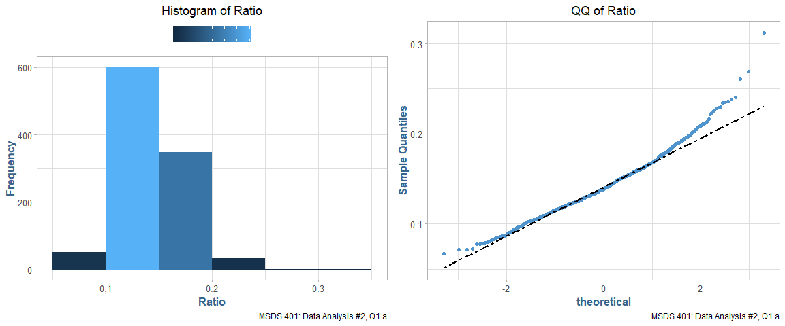<!-- -->
---------------------
 Kurtosis   Skewness 
---------- ----------
  1.667      0.7147  
---------------------

### b.) Log Scale

__(2 points)__

+ Tranform RATIO using *log10()* to create L_RATIO (Kabacoff Section 8.5.2, p. 199-200). 
+ Form a histogram and QQ plot using __L_RATIO__. 
+ Calculate the skewness and kurtosis. 
+ Create a boxplot of __L_RATIO__ differentiated by __CLASS__.

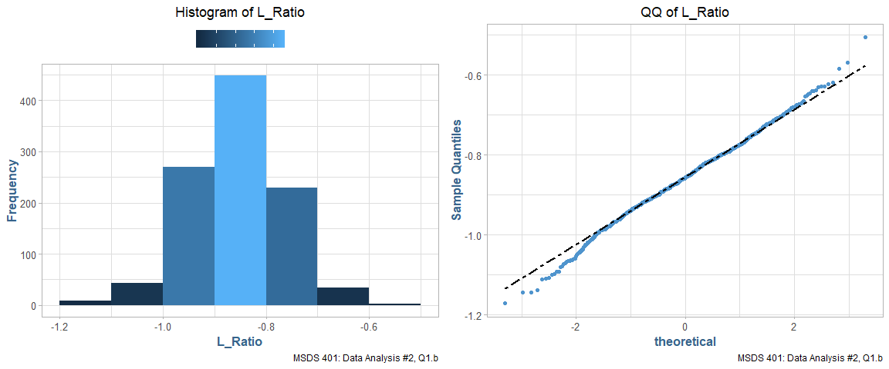<!-- -->


---------------------
 Kurtosis   Skewness 
---------- ----------
  0.5354    -0.09392 
---------------------


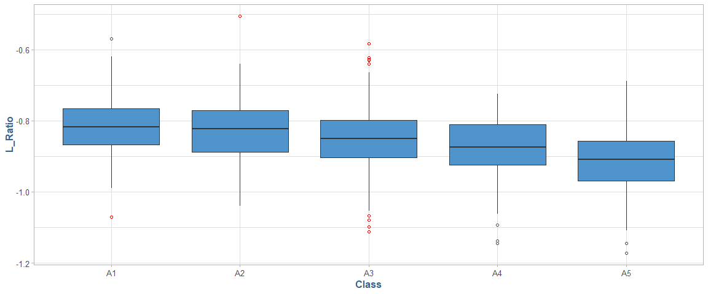<!-- -->

### c.) Bartlett's Test
__(1 point)__

+ Test the homogeneity of variance across classes using *bartlett.test()* 

_(Kabacoff Section 9.2.2, p. 222)._

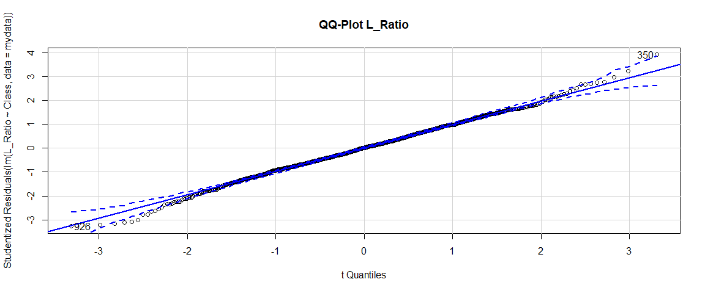<!-- -->

```
## [1] 350 926
```

```
## 
## 	Bartlett test of homogeneity of variances
## 
## data:  L_Ratio by Class
## Bartlett's K-squared = 3.1891, df = 4, p-value = 0.5267
```


--------------------
      P_Value       
--------------------
 Cannot Reject Null 
--------------------

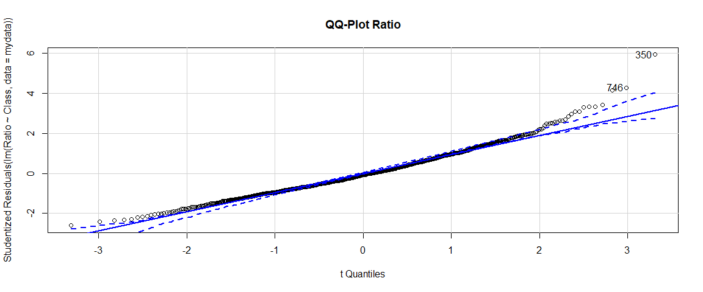<!-- -->

```
## [1] 350 746
```

```
## 
## 	Bartlett test of homogeneity of variances
## 
## data:  Ratio by Class
## Bartlett's K-squared = 21.49, df = 4, p-value = 0.0002531
```


-------------
   P_Value   
-------------
 Reject Null 
-------------

__Question (2 points):__ 

+Based on steps 1.a, 1.b and 1.c, which variable RATIO or L_RATIO exhibits better conformance to a normal distribution with homogeneous variances across age classes?  
+ Why?
 
__Answer:__

__L_Ratio__ exhibits better conformance to normality across classes due to the QQ-Plots falling closer in-line with the expected quantiles, lower Kurtosis, as well as having a less skewed 
distribution as observed by both the skewness measure and the histograms of the respective variables. Finally, at 0.05 significance level, we cannot reject the null hypothesis that
L_Ratio comes from a normal distribution according to Bartless's Test for Equality of Variances, which we must do for Ratio as if falls well short of significance.

-----

## 2.) Analysis of Variance

### a.) ANOVA

__(2 points)__

+ Perform an analysis of variance with *aov()* on L_RATIO using CLASS and SEX as the independent variables _(Kabacoff chapter 9, p. 212-229)_. 
+ Assume equal variances. 
+ Perform two analyses. 
+ First, fit a model _with_ the interaction term __CLASS:SEX__. 
+ Then, fit a model _without_ __CLASS:SEX__. 
+ Use *summary()* to obtain the analysis of variance tables (_Kabacoff chapter 9, p. 227_).

<table class="table table-striped table-hover" style="margin-left: auto; margin-right: auto;">
<caption>L_Ratio ~ Class * Sex</caption>
 <thead>
  <tr>
   <th style="text-align:left;"> Variable </th>
   <th style="text-align:right;"> Df </th>
   <th style="text-align:right;"> Sum Sq </th>
   <th style="text-align:right;"> Mean Sq </th>
   <th style="text-align:right;"> F value </th>
   <th style="text-align:right;"> Pr(&gt;F) </th>
  </tr>
 </thead>
<tbody>
  <tr>
   <td style="text-align:left;"> Class </td>
   <td style="text-align:right;"> 4 </td>
   <td style="text-align:right;"> 1.0554 </td>
   <td style="text-align:right;"> 0.2638 </td>
   <td style="text-align:right;"> 38.3699 </td>
   <td style="text-align:right;"> 0.0000 </td>
  </tr>
  <tr>
   <td style="text-align:left;"> Sex </td>
   <td style="text-align:right;"> 2 </td>
   <td style="text-align:right;"> 0.0914 </td>
   <td style="text-align:right;"> 0.0457 </td>
   <td style="text-align:right;"> 6.6444 </td>
   <td style="text-align:right;"> 0.0014 </td>
  </tr>
  <tr>
   <td style="text-align:left;"> Class:Sex </td>
   <td style="text-align:right;"> 8 </td>
   <td style="text-align:right;"> 0.0267 </td>
   <td style="text-align:right;"> 0.0033 </td>
   <td style="text-align:right;"> 0.4855 </td>
   <td style="text-align:right;"> 0.8671 </td>
  </tr>
  <tr>
   <td style="text-align:left;"> Residuals </td>
   <td style="text-align:right;"> 1021 </td>
   <td style="text-align:right;"> 7.0206 </td>
   <td style="text-align:right;"> 0.0069 </td>
   <td style="text-align:right;"> NA </td>
   <td style="text-align:right;"> NA </td>
  </tr>
</tbody>
</table>

<table class="table table-striped table-hover" style="margin-left: auto; margin-right: auto;">
<caption>L_Ratio ~ Class + Sex</caption>
 <thead>
  <tr>
   <th style="text-align:left;"> Variable </th>
   <th style="text-align:right;"> Df </th>
   <th style="text-align:right;"> Sum Sq </th>
   <th style="text-align:right;"> Mean Sq </th>
   <th style="text-align:right;"> F value </th>
   <th style="text-align:right;"> Pr(&gt;F) </th>
  </tr>
 </thead>
<tbody>
  <tr>
   <td style="text-align:left;"> Class </td>
   <td style="text-align:right;"> 4 </td>
   <td style="text-align:right;"> 1.0554 </td>
   <td style="text-align:right;"> 0.2638 </td>
   <td style="text-align:right;"> 38.524 </td>
   <td style="text-align:right;"> 0.0000 </td>
  </tr>
  <tr>
   <td style="text-align:left;"> Sex </td>
   <td style="text-align:right;"> 2 </td>
   <td style="text-align:right;"> 0.0914 </td>
   <td style="text-align:right;"> 0.0457 </td>
   <td style="text-align:right;"> 6.671 </td>
   <td style="text-align:right;"> 0.0013 </td>
  </tr>
  <tr>
   <td style="text-align:left;"> Residuals </td>
   <td style="text-align:right;"> 1029 </td>
   <td style="text-align:right;"> 7.0473 </td>
   <td style="text-align:right;"> 0.0068 </td>
   <td style="text-align:right;"> NA </td>
   <td style="text-align:right;"> NA </td>
  </tr>
</tbody>
</table>

__Question (2 points):__

+ Compare the two analyses.
+ What does the non-significant interaction term suggest about the relationship between __L_RATIO__ and the factors __CLASS__ and __SEX__?

__Answer:__

It means the join effect of Class and Sex is not statistically higher than the sum of both effect individually.

### b.) Tukey
__(2 points)__

+ For the model without __CLASS:SEX__ (i.e. an interaction term), obtain multiple comparisons with the *TukeyHSD()* function. 
+ Interpret the results at the 95% confidence level (*TukeyHSD()* will adjust for unequal sample sizes). 

<table class="table table-striped table-hover" style="margin-left: auto; margin-right: auto;">
<caption>Tukey Class</caption>
 <thead>
  <tr>
   <th style="text-align:left;">   </th>
   <th style="text-align:right;"> diff </th>
   <th style="text-align:right;"> lwr </th>
   <th style="text-align:right;"> upr </th>
   <th style="text-align:right;"> p adj </th>
  </tr>
 </thead>
<tbody>
  <tr>
   <td style="text-align:left;"> A2-A1 </td>
   <td style="text-align:right;"> -0.012 </td>
   <td style="text-align:right;"> -0.039 </td>
   <td style="text-align:right;"> 0.014 </td>
   <td style="text-align:right;"> 0.692 </td>
  </tr>
  <tr>
   <td style="text-align:left;"> A3-A1 </td>
   <td style="text-align:right;"> -0.034 </td>
   <td style="text-align:right;"> -0.059 </td>
   <td style="text-align:right;"> -0.009 </td>
   <td style="text-align:right;"> 0.002 </td>
  </tr>
  <tr>
   <td style="text-align:left;"> A4-A1 </td>
   <td style="text-align:right;"> -0.059 </td>
   <td style="text-align:right;"> -0.086 </td>
   <td style="text-align:right;"> -0.031 </td>
   <td style="text-align:right;"> 0.000 </td>
  </tr>
  <tr>
   <td style="text-align:left;"> A5-A1 </td>
   <td style="text-align:right;"> -0.100 </td>
   <td style="text-align:right;"> -0.128 </td>
   <td style="text-align:right;"> -0.072 </td>
   <td style="text-align:right;"> 0.000 </td>
  </tr>
  <tr>
   <td style="text-align:left;"> A3-A2 </td>
   <td style="text-align:right;"> -0.022 </td>
   <td style="text-align:right;"> -0.041 </td>
   <td style="text-align:right;"> -0.002 </td>
   <td style="text-align:right;"> 0.018 </td>
  </tr>
  <tr>
   <td style="text-align:left;"> A4-A2 </td>
   <td style="text-align:right;"> -0.046 </td>
   <td style="text-align:right;"> -0.068 </td>
   <td style="text-align:right;"> -0.024 </td>
   <td style="text-align:right;"> 0.000 </td>
  </tr>
  <tr>
   <td style="text-align:left;"> A5-A2 </td>
   <td style="text-align:right;"> -0.087 </td>
   <td style="text-align:right;"> -0.110 </td>
   <td style="text-align:right;"> -0.065 </td>
   <td style="text-align:right;"> 0.000 </td>
  </tr>
  <tr>
   <td style="text-align:left;"> A4-A3 </td>
   <td style="text-align:right;"> -0.024 </td>
   <td style="text-align:right;"> -0.045 </td>
   <td style="text-align:right;"> -0.004 </td>
   <td style="text-align:right;"> 0.011 </td>
  </tr>
  <tr>
   <td style="text-align:left;"> A5-A3 </td>
   <td style="text-align:right;"> -0.066 </td>
   <td style="text-align:right;"> -0.087 </td>
   <td style="text-align:right;"> -0.045 </td>
   <td style="text-align:right;"> 0.000 </td>
  </tr>
  <tr>
   <td style="text-align:left;"> A5-A4 </td>
   <td style="text-align:right;"> -0.041 </td>
   <td style="text-align:right;"> -0.065 </td>
   <td style="text-align:right;"> -0.018 </td>
   <td style="text-align:right;"> 0.000 </td>
  </tr>
</tbody>
</table>

<table class="table table-striped table-hover" style="margin-left: auto; margin-right: auto;">
<caption>Tukey Sex</caption>
 <thead>
  <tr>
   <th style="text-align:left;">   </th>
   <th style="text-align:right;"> diff </th>
   <th style="text-align:right;"> lwr </th>
   <th style="text-align:right;"> upr </th>
   <th style="text-align:right;"> p adj </th>
  </tr>
 </thead>
<tbody>
  <tr>
   <td style="text-align:left;"> Female-Infant </td>
   <td style="text-align:right;"> 0.016 </td>
   <td style="text-align:right;"> 0.001 </td>
   <td style="text-align:right;"> 0.031 </td>
   <td style="text-align:right;"> 0.038 </td>
  </tr>
  <tr>
   <td style="text-align:left;"> Male-Infant </td>
   <td style="text-align:right;"> 0.018 </td>
   <td style="text-align:right;"> 0.003 </td>
   <td style="text-align:right;"> 0.033 </td>
   <td style="text-align:right;"> 0.011 </td>
  </tr>
  <tr>
   <td style="text-align:left;"> Male-Female </td>
   <td style="text-align:right;"> 0.002 </td>
   <td style="text-align:right;"> -0.013 </td>
   <td style="text-align:right;"> 0.017 </td>
   <td style="text-align:right;"> 0.941 </td>
  </tr>
</tbody>
</table>

__Question (2 points):__

+ First, interpret the trend in coefficients across age classes. 
+ What is this indicating about __L_RATIO__?
+ Second, do these results suggest male and female abalones can be combined into a single category labeled as 'adults?' 
+ If not, why not?

__Answer:__

The trends in age class is interesting in that for the Age Classes A3, A4 and A5 the L_Ratio values are not significantly significant (at a 95% level) from each other meaning that there is no relationship to L_Ratio and Age Classes A3, A4 and A5.
However, for the A1 and A2 classes there is a clear relationship between the Age Class and the value of L_Ratio.

Secondly, Male and Female abalones have a .941 similarity in means, suggesting they're well beyond statistically significant, almost to the point of being identical. It would
be logical to just combine them and split the abalones into Infants and Adults for ratio analysis.

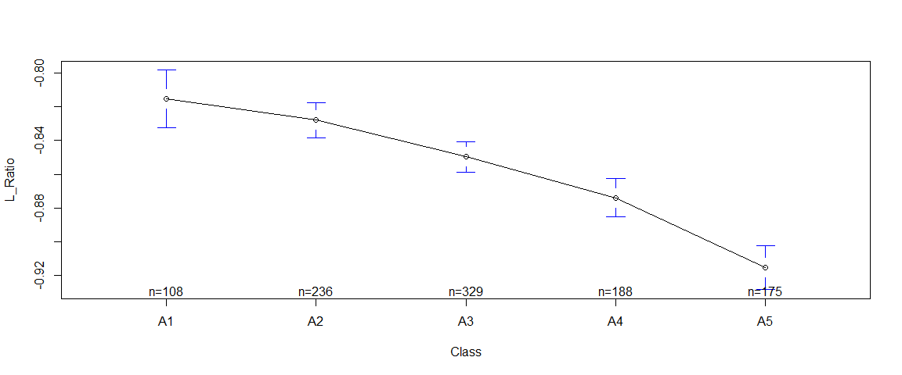<!-- -->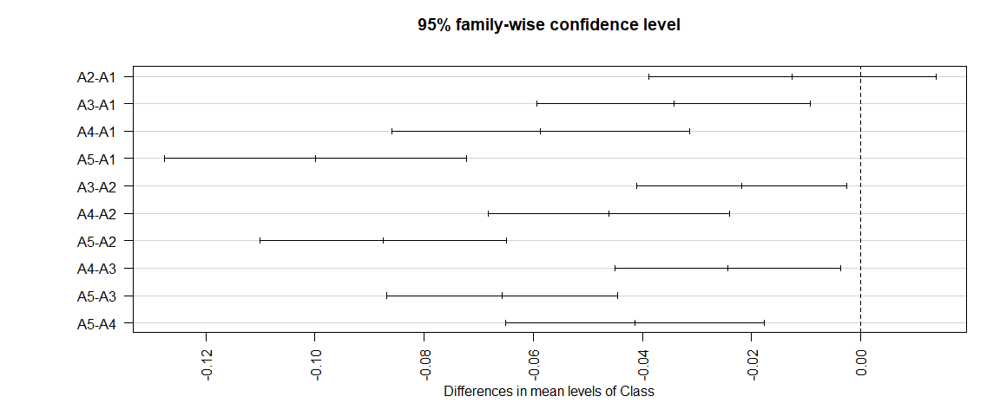<!-- -->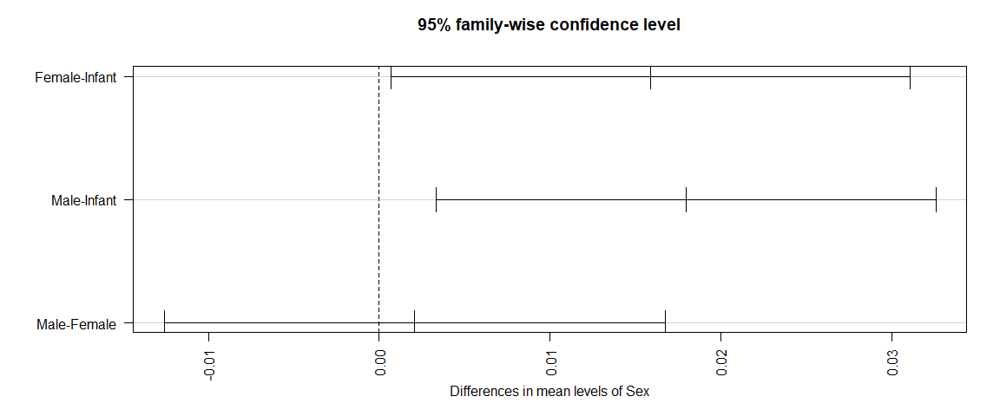<!-- -->

-----

## 3.) Infant / Adult

### a.) Type

__(2 points)__

+ Use *combineLevels()* from the 'rockchalk' package to combine "M" and "F" into a new level, "__ADULT__". This will necessitate defining a new variable, __TYPE__, 
in mydata which will have two levels:  "__I__" and "__ADULT__". 
+ Present side-by-side histograms of VOLUME. 
+ One should display infant volumes and, the other, adult volumes. 

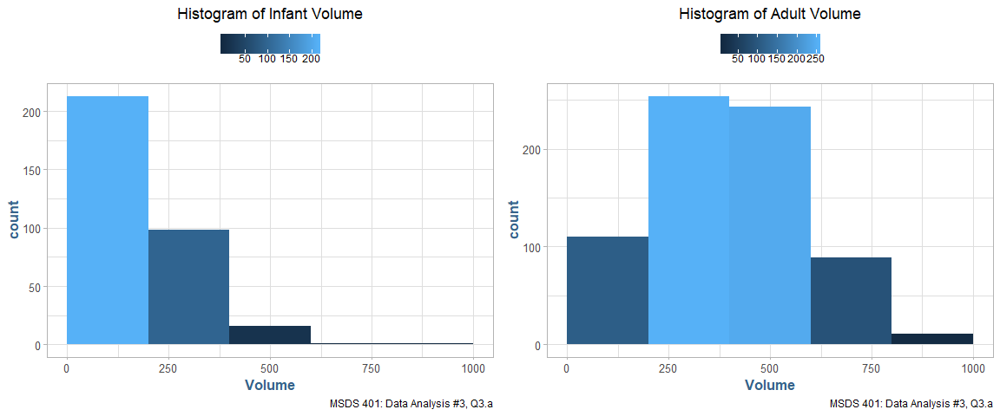<!-- -->

__Question (2 points):__

+ Compare the histograms.
+ How do the distributions differ? 
+ Are there going to be any difficulties separating infants from adults based on __VOLUME__?

__Answer:__

The two distributions have distinct shapes, however, there is a significant amout of overlap in the 0 - 500 range. An abalone having volume > 500 we could assume with relative
saftey would be adult, however, there are a significant amount of both infant and adult abalone in the lower range. Around 90% of infant abalone have a Volume measure
that's less than the lower 50% of adult abalones, giving us reason to be concerned about overlap here.


-----------------------
 Adult.50%   Adult.75% 
----------- -----------
   388.7       530.4   
-----------------------


-----------------------
 Adult.50%   Adult.90% 
----------- -----------
   148.5       331.1   
-----------------------

### b.) Shuck ~ Volume
__(3 points)__

+ Create a scatterplot of __SHUCK__ versus __VOLUME__ and a scatterplot of their base ten logarithms, labeling the variables as __L_SHUCK__ and __L_VOLUME__. 
+ Please be aware the variables, __L_SHUCK__ and __L_VOLUME__, present the data as orders of magnitude (i.e. VOLUME = 100 = 10^2 becomes L_VOLUME = 2). 
+ Use color to differentiate __CLASS__ in the plots. 
+ Repeat using color to differentiate by __TYPE__. 

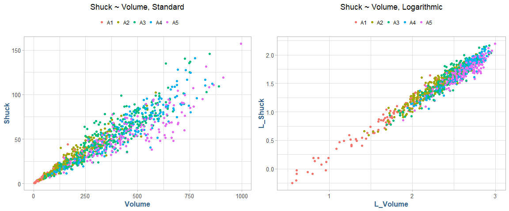<!-- -->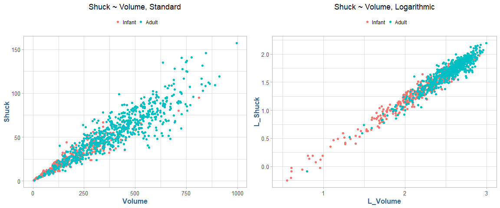<!-- -->

__Question (3 points): __

Compare the two scatterplots.

+ What effect(s) does log-transformation appear to have on the variability present in the plot?  
+ What are the implications for linear regression analysis? 
+ Where do the various CLASS levels appear in the plots? 
+ Where do the levels of TYPE appear in the plots?

__Answer__:

There is a reduction of variability of the logarithmic transformed Volume variable and gives clearer separation between the sex and age in the distribution. 
The logarithmic version is considerably more suited for linear regression analysis. The sex variable is particularly well distributed with a visible cutoff 
of the majority of infants lie below 2 on the logarithmic scale. Logarithmic version of Class also shows better conformity to a linear model, however, 
the top 3 age classes, A3, A4 and A5 still exhibit a considerable amount of clustering at the right end of the scale.


----------------------
   Ratio     L_Ratio  
----------- ----------
 0.0008599   0.007917 
----------------------

-----

## 4.) Age Class

### a.) Regression
__(3 points)__

+ Since abalone growth slows after class __A3__, infants in classes __A4 and A5__ are considered mature and candidates for harvest. 
+ Reclassify the infants in classes __A4 and A5__ as _ADULTS_.
+ This reclassification can be achieved using *combineLevels()*, but only on the abalones in classes __A4 and A5__. 
+ You will use this recoded TYPE variable, in which the infants in __A4__ and __A5__ are reclassified as _ADULTS_, for the remainder of this data analysis assignment.

+ Regress __L_SHUCK__ as the dependent variable on __L_VOLUME__, __CLASS__ and __TYPE__ (Kabacoff Section 8.2.4, p. 178-186, the Data Analysis Video #2 and Black Section 14.2). 
+ Use the multiple regression model: __L_SHUCK ~ L_VOLUME + CLASS + TYPE__. 
+ Apply *summary()* to the model object to produce results.

<br />


  * **Model**: L_Shuck ~ L_Volume + Class + Type

<!-- end of list -->


---------------------------------------------------------
  Min.     1st Qu.     Median    Mean   3rd Qu.    Max.  
--------- ---------- ---------- ------ --------- --------
 -0.2706   -0.05429   0.000159    0     0.05599   0.3097 
---------------------------------------------------------

<table class="table table-striped table-hover" style="margin-left: auto; margin-right: auto;">
<caption>Coefficients</caption>
 <thead>
  <tr>
   <th style="text-align:left;"> Variable </th>
   <th style="text-align:right;"> Estimate </th>
   <th style="text-align:right;"> Std. Error </th>
   <th style="text-align:right;"> t value </th>
   <th style="text-align:right;"> Pr(&gt;|t|) </th>
  </tr>
 </thead>
<tbody>
  <tr>
   <td style="text-align:left;"> (Intercept) </td>
   <td style="text-align:right;"> -0.81751 </td>
   <td style="text-align:right;"> 0.01904 </td>
   <td style="text-align:right;"> -42.93573 </td>
   <td style="text-align:right;"> 0.00000 </td>
  </tr>
  <tr>
   <td style="text-align:left;"> L_Volume </td>
   <td style="text-align:right;"> 0.99930 </td>
   <td style="text-align:right;"> 0.01026 </td>
   <td style="text-align:right;"> 97.37662 </td>
   <td style="text-align:right;"> 0.00000 </td>
  </tr>
  <tr>
   <td style="text-align:left;"> ClassA2 </td>
   <td style="text-align:right;"> -0.01801 </td>
   <td style="text-align:right;"> 0.01100 </td>
   <td style="text-align:right;"> -1.63610 </td>
   <td style="text-align:right;"> 0.10212 </td>
  </tr>
  <tr>
   <td style="text-align:left;"> ClassA3 </td>
   <td style="text-align:right;"> -0.04731 </td>
   <td style="text-align:right;"> 0.01247 </td>
   <td style="text-align:right;"> -3.79282 </td>
   <td style="text-align:right;"> 0.00016 </td>
  </tr>
  <tr>
   <td style="text-align:left;"> ClassA4 </td>
   <td style="text-align:right;"> -0.07578 </td>
   <td style="text-align:right;"> 0.01406 </td>
   <td style="text-align:right;"> -5.39142 </td>
   <td style="text-align:right;"> 0.00000 </td>
  </tr>
  <tr>
   <td style="text-align:left;"> ClassA5 </td>
   <td style="text-align:right;"> -0.11712 </td>
   <td style="text-align:right;"> 0.01413 </td>
   <td style="text-align:right;"> -8.28816 </td>
   <td style="text-align:right;"> 0.00000 </td>
  </tr>
  <tr>
   <td style="text-align:left;"> TypeAdult </td>
   <td style="text-align:right;"> 0.02109 </td>
   <td style="text-align:right;"> 0.00769 </td>
   <td style="text-align:right;"> 2.74373 </td>
   <td style="text-align:right;"> 0.00618 </td>
  </tr>
</tbody>
</table>


---------------------------------------------------------
 Residual_Std_Error   dof    Multiple_RSq   Adjusted_Rsq 
-------------------- ------ -------------- --------------
      0.08297         1029      0.9504         0.9501    
---------------------------------------------------------


------------------------------------------------------
 F_Stat.value   F_Stat.numdf   F_Stat.dendf   p-value 
-------------- -------------- -------------- ---------
     3287            6             1029          0    
------------------------------------------------------
    
__Question (2 points):__

+ Interpret the trend in __CLASS__ levelcoefficient estimates? 

_(Hint:  this question is not asking if the estimates are statistically significant. 
It is asking for an interpretation of the pattern in these coefficients, and how this pattern relates to the earlier displays)._

__Answer:__

The age class level coefficients show a clear increasingly trend in the Class variable with respect to L_Shuck. Given the
intercept is negative (meaning the expected value of Shuck would be negative given a value of 0 for our predictors), this means that we 
would expect to add an increasingly large negative number as the classes go from A3 -> A5 (A2 is arguably not stastically significant from A1, at a 10% level,
while A3, A4 and A5 are), meaning that as that the class level variable increases, we would also expect L_Shuck to increase. 
This is the pattern we also see in the displays.

__Question (2 points):__ 

+ Is __TYPE__ an important predictor in this regression? 

_(Hint:  This question is not asking if TYPE is statistically significant, but rather how it compares to the other independent 
variables in terms of its contribution to predictions of L_SHUCK for harvesting decisions.)_

Explain your conclusion.

__Answer:__

Type is also an important predictor in determining when to harvest abalone. The TypeAdult variable tells us that we can expect to add
.02 to the Shuck variable when the Type is Adult, meaning that in general Adult abalone are larger in Shuck and Volume than
Infant abalone, which is consistant with our display in __3b__.

-----

The next two analysis steps involve an analysis of the residuals resulting from the regression model in __(4)(a)__.

_(Kabacoff Section 8.2.4, p. 178-186, the Data Analysis Video #2)_.

-----

## 5.) Residual Analysis

### a.) Normality

__(3 points)__

+ If "model" is the regression object, use model$residuals and construct a histogram and QQ plot. 
+ Compute the skewness and kurtosis. 
+ Be aware that with 'rockchalk,' the kurtosis value has 3.0 subtracted from it which differs from the 'moments' package. 

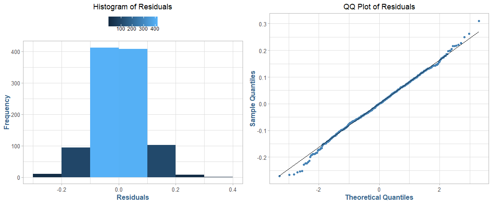<!-- -->
---------------------
 Kurtosis   Skewness 
---------- ----------
  0.3433    -0.05945 
---------------------

### b.) Variance
__(3 points)__

+ Plot the residuals versus __L_VOLUME__, coloring the data points by __CLASS__ and, a second time, coloring the data points by __TYPE__. 
+ Keep in mind the y-axis and x-axis may be disproportionate which will amplify the variability in the residuals. 
+ Present boxplots of the residuals differentiated by __CLASS__ and __TYPE__ (These four plots can be conveniently presented on one page using *par(mfrow..)* or *grid.arrange()*. 
+ Test the homogeneity of variance of the residuals across classes using *bartlett.test()* (Kabacoff Section 9.3.2, p. 222).  

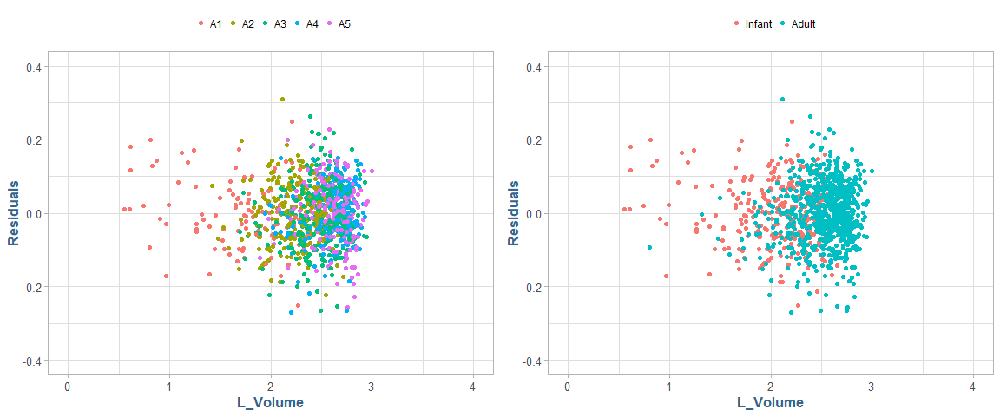<!-- -->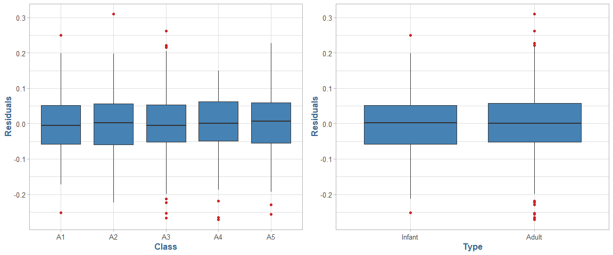<!-- -->

```
## 
## 	Bartlett test of homogeneity of variances
## 
## data:  Residuals by Class
## Bartlett's K-squared = 3.6882, df = 4, p-value = 0.4498
```

__Question (3 points):__  

+ What is revealed by the displays and calculations in __(5)(a)__ and __(5)(b)__? 
+ Does the model 'fit'?  
+ Does this analysis indicate that __L_VOLUME__, and ultimately __VOLUME__, might be useful for harvesting decisions? 
+ __Discuss.__

__Answer:__

The plots in __(5)(a)__ show a reasonably symmetric histogram and QQ plot, although there are a few outliers in the residuals, prominently distinguishable in
the QQ-Plot. The histogram shows a great deal of clustering in the middle, however, also looking at the Kurtosis and Skewness of the residuals, we can see
they are approximately zero indicating a relatively normal behavior indicating our model is relatively well fit for the data and that it may ultimately 
provide useful in determining when to harvest abalone. The Bartlett test performed on Age Class indicates that the variance amoungst the Age Classes
don't differ significantly __(p = .45)__, although the presence of a several outliers is an area of concern.

-----

There is a tradeoff faced in managing abalone harvest. The infant population must be protected since it represents future harvests. On the other hand, the harvest should be designed to be efficient with a yield to justify the effort. This assignment will use VOLUME to form binary decision rules to guide harvesting. If VOLUME is below a "cutoff" (i.e. a specified volume), that individual will not be harvested. If above, it will be harvested. Different rules are possible.

The next steps in the assignment will require consideration of the proportions of infants and adults harvested at different cutoffs. 

+ For this, similar "for-loops" will be used to compute the harvest proportions. These loops must use the same values for the constants min.v and delta and use the same statement "for(k in 1:10000)." 
+ Otherwise, the resulting infant and adult proportions cannot be directly compared and plotted as requested. Note the example code supplied below.

-----

## 6.) Optimal Harvesting

### a.) Split Values

__(2 points)__

A series of volumes covering the range from minimum to maximum abalone volume will be used in a "for loop" to determine how the harvest proportions change as the "cutoff" changes. 

_Code for doing this is provided._


----------------------------
 Infant Split   Adult Split 
-------------- -------------
    133.8          384.5    
----------------------------

### b.) Split Visual

__(2 points)__

Present a plot showing the infant proportions and the adult proportions versus volume.value. Compute the 50% "split" volume.value for each and show on the plot.   

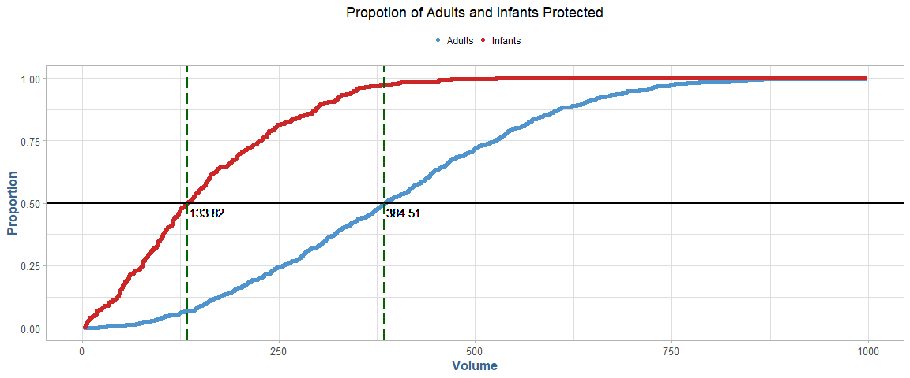<!-- -->

__Question (2 points):__

The two 50% "split" values serve a descriptive purpose illustrating the difference between the populations. 

+ What do these values suggest regarding possible cutoffs for harvesting?

__Answer:__

From the information displayed, it would suggest to me that Infants will be harvested at a disproportional rate than Adult abalone based on the
determined volume cutoff. The slope of the Infant line is much steeper and reaches the cutoff point relatively quickly, meaning  We have a high likelyhood 
of harvesting a disproportant amount of infants leading to an overall less than optimal harvest yield.

-----

This part will address the determination of a volume.value corresponding to the observed maximum difference in harvest percentages of adults and infants. 
To calculate this result, the vectors of proportions from item __(6)__ must be used. 
These proportions must be converted from "not harvested" to "harvested" proportions by using *(1 - prop.infants)* for infants, and *(1 - prop.adults)* for adults. 
The reason the proportion for infants drops sooner than adults is that infants are maturing and becoming adults with larger volumes.

-----

## 7.) Harvest Proportions

### a.) Difference
__(1 point)__

+ Evaluate a plot of the difference *((1 - prop.adults) - (1 - prop.infants))* versus volume.value. 
+ Compare to the 50% "split" points determined in __(6)(a)__. 
+ There is considerable variability present in the peak area of this plot. 
+ The observed "peak" difference may not be the best representation of the data. 
+ One solution is to smooth the data to determine a more representative estimate of the maximum difference.

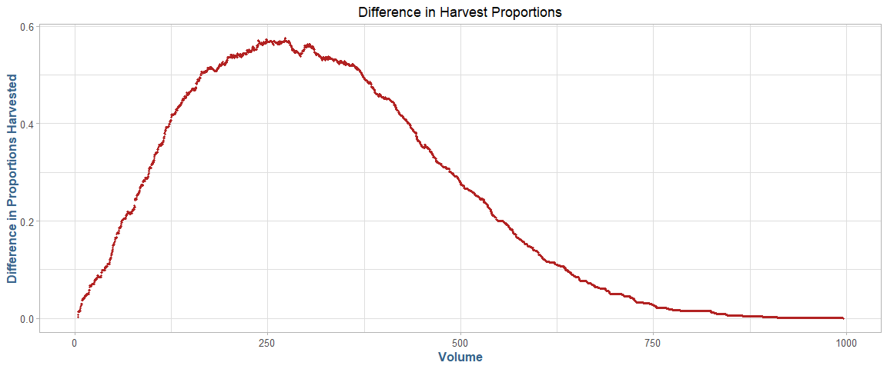<!-- -->

### b.) Smoothed
__(1 point)__

+ Since curve smoothing is not studied in this course, code is supplied below. 
+ Execute the following code to create a smoothed curve to append to the plot in __(a)__. 
+ The procedure is to individually smooth (1-prop.adults) and (1-prop.infants) before determining an estimate of the maximum difference. 

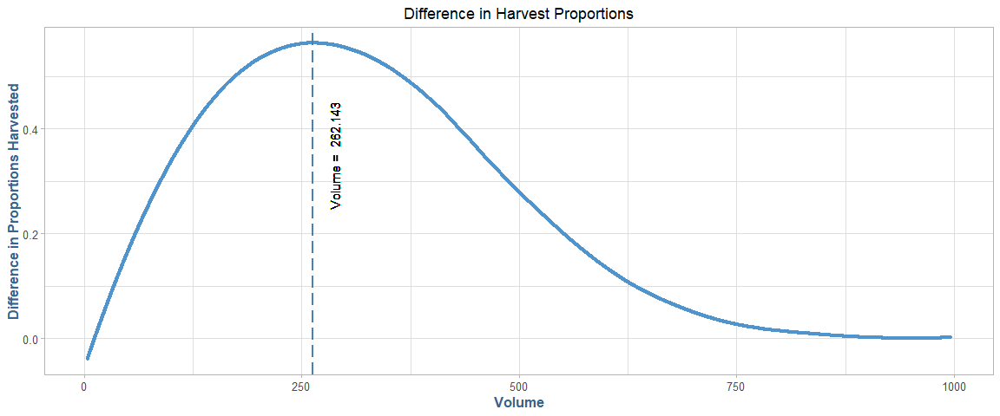<!-- -->

### c.) Combined
__(3 points)__

+ Present a plot of the difference *((1 - prop.adults) - (1 - prop.infants))* versus volume.value with the variable smooth.difference superimposed. 
+ Determine the volume.value corresponding to the maximum smoothed difference (Hint: use *which.max()*). 
+ Show the estimated peak location corresponding to the cutoff determined.

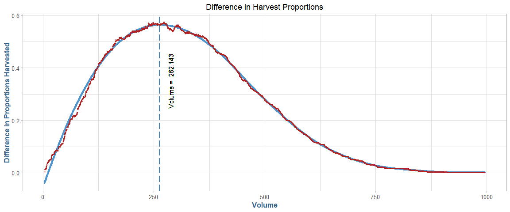<!-- -->

### d.) Cutoff
__(1 point)__

+ What separate harvest proportions for infants and adults would result if this cutoff is used? 
+ Show the separate harvest proportions (NOTE: the adult harvest proportion is the __"true positive rate"__ and the infant harvest proportion is the __"false positive rate"__).

<table class="table table-striped table-hover" style="margin-left: auto; margin-right: auto;">
<caption>Max Difference</caption>
 <thead>
  <tr>
   <th style="text-align:left;"> Type </th>
   <th style="text-align:right;"> Volume </th>
   <th style="text-align:right;"> TPR </th>
   <th style="text-align:right;"> FPR </th>
   <th style="text-align:right;"> Yield </th>
  </tr>
 </thead>
<tbody>
  <tr>
   <td style="text-align:left;"> max.difference </td>
   <td style="text-align:right;"> 262.143 </td>
   <td style="text-align:right;"> 0.742 </td>
   <td style="text-align:right;"> 0.176 </td>
   <td style="text-align:right;"> 0.584 </td>
  </tr>
</tbody>
</table>

-----

There are alternative ways to determine cutoffs. Two such cutoffs are described below.

-----

## 8.) Alternative Cutoffs

### a.) Zero A1 Infants
__(2 points)__

Harvesting of infants in CLASS "__A1__" must be minimized. The smallest volume.value cutoff that produces a zero harvest of infants from CLASS "__A1__" may be used as a baseline for 
comparison with larger cutoffs. Any smaller cutoff would result in harvesting infants from CLASS "__A1__."  

Compute this cutoff, and the proportions of infants and adults with __VOLUME__ exceeding this cutoff. Code for determining this cutoff is provided. Show these proportions.

<table class="table table-striped table-hover" style="margin-left: auto; margin-right: auto;">
<caption>Zero A1 Infants</caption>
 <thead>
  <tr>
   <th style="text-align:left;"> Type </th>
   <th style="text-align:right;"> Volume </th>
   <th style="text-align:right;"> TPR </th>
   <th style="text-align:right;"> FPR </th>
   <th style="text-align:right;"> Yield </th>
  </tr>
 </thead>
<tbody>
  <tr>
   <td style="text-align:left;"> zero.A1.infants </td>
   <td style="text-align:right;"> 206.786 </td>
   <td style="text-align:right;"> 0.826 </td>
   <td style="text-align:right;"> 0.287 </td>
   <td style="text-align:right;"> 0.676 </td>
  </tr>
</tbody>
</table>

### b.) Inverse Cutoff
__(2 points)__

Another cutoff is one for which the proportion of adults not harvested equals the proportion of infants harvested. 

+ This cutoff would equate these rates; effectively, our two errors:  'missed' adults and wrongly-harvested infants. 
+ This leaves for discussion which is the greater loss: a larger proportion of adults not harvested or infants harvested?  
+ This cutoff is 237.6391. 
+ Calculate the separate harvest proportions for infants and adults using this cutoff. Show these proportions.  

_Code for determining this cutoff is provided._

<table class="table table-striped table-hover" style="margin-left: auto; margin-right: auto;">
<caption>Equal Error</caption>
 <thead>
  <tr>
   <th style="text-align:left;"> Type </th>
   <th style="text-align:right;"> Volume </th>
   <th style="text-align:right;"> TPR </th>
   <th style="text-align:right;"> FPR </th>
   <th style="text-align:right;"> Yield </th>
  </tr>
 </thead>
<tbody>
  <tr>
   <td style="text-align:left;"> equal.error </td>
   <td style="text-align:right;"> 237.639 </td>
   <td style="text-align:right;"> 0.782 </td>
   <td style="text-align:right;"> 0.218 </td>
   <td style="text-align:right;"> 0.625 </td>
  </tr>
</tbody>
</table>

-----

## 9.) ROC

### a.) Visual Area
__(6 points)__

+ Construct an ROC curve by plotting *(1 - prop.adults)* versus *(1 - prop.infants)*. 
+ Each point which appears corresponds to a particular volume.value. 
+ Show the location of the cutoffs determined in __(7)__ and __(8)__ on this plot and label each. 

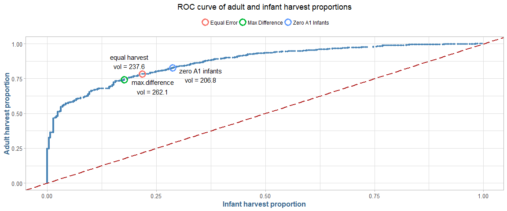<!-- -->

### b.) Numerical Area
__(1 point)__

+ Numerically integrate the area under the ROC curve and report your result. This is most easily done with the *auc()* function from the "flux" package. 
+ Areas-under-curve, or AUCs, greater than 0.8 are taken to indicate good discrimination potential. 


------------------
 Area Under Curve 
------------------
      0.8667      
------------------

-----

## 10.) Results

### a.) Consolidated
__(3 points)__

Prepare a table showing each cutoff along with the following:

+ 1.) __true positive__ rate (1-prop.adults,
+ 2.) __false positive__ rate (1-prop.infants),
+ 3.) harvest proportion of the __total population__
 	
<table class="table table-striped table-hover" style="margin-left: auto; margin-right: auto;">
<caption>Consolidated Harvest Proportions</caption>
 <thead>
  <tr>
   <th style="text-align:left;"> Type </th>
   <th style="text-align:right;"> Volume </th>
   <th style="text-align:right;"> TPR </th>
   <th style="text-align:right;"> FPR </th>
   <th style="text-align:right;"> Yield </th>
  </tr>
 </thead>
<tbody>
  <tr>
   <td style="text-align:left;"> max.difference </td>
   <td style="text-align:right;"> 262.143 </td>
   <td style="text-align:right;"> 0.742 </td>
   <td style="text-align:right;"> 0.176 </td>
   <td style="text-align:right;"> 0.584 </td>
  </tr>
  <tr>
   <td style="text-align:left;"> zero.A1.infants </td>
   <td style="text-align:right;"> 206.786 </td>
   <td style="text-align:right;"> 0.826 </td>
   <td style="text-align:right;"> 0.287 </td>
   <td style="text-align:right;"> 0.676 </td>
  </tr>
  <tr>
   <td style="text-align:left;"> equal.error </td>
   <td style="text-align:right;"> 237.639 </td>
   <td style="text-align:right;"> 0.782 </td>
   <td style="text-align:right;"> 0.218 </td>
   <td style="text-align:right;"> 0.625 </td>
  </tr>
</tbody>
</table>
 	
__Question: (1 point)__

Based on the ROC curve, it is evident a wide range of possible "cutoffs" exist. 
Compare and discuss the three cutoffs determined in this assignment.  

__Answer:__

The three various cutoffs represent distinct characteristics of a given harvest of abalones. The max difference method which is essentially the ?brute force? solution here, I believe represents arguably the worst-case scenario. The true-positive rate is the lowest of the three, as well as the lowest overall harvest yield ratio. Although, this method does have the lowest false-positive rate as well.

The Zero A1 Infants harvest has the benefit of having the highest true-positive harvest rate and overall harvest yield. The drawback here is that this method also leads to the highest rate of false-positives, meaning more infants will ultimately get harvested which isn?t ideal for future harvest and sustainability.

The equal error methodology is, as the name implies, right down the middle in terms of true-positive rate, false-positive rate, and overall harvest yield, essentially splitting max on the low end and Zero A1 on the high end (in terms of error).


-----

__Question (8 points):__ 

Assume you are expected to make a presentation of your analysis to the investigators How would you do so?  
Consider the following in your answer:

1. Would you make a specific recommendation or outline various choices and tradeoffs?
2. What qualifications or limitations would you present regarding your analysis?
3. If it is necessary to proceed based on the current analysis, what suggestions would you have for implementation of a cutoff? 
4. What suggestions would you have for planning future abalone studies of this type? 

__Answer:__

Given that there is no clear harvesting strategy that has 'best fit' for all use-cases involved (harvest yield, protection of infants, and minimization of 
false-positivies, _coupled with the fact that I am not an SME on abalone harvesting_, I would not recommend any single strategy but rather simply
present the findings above and present the various trade-offs each technique presents and let the experts decide.

The qualifications here are that this is an observational study on which we had no control over the sample gathered, thefore causality cannot be firmly
established if we cannot control the variables under study. This must be understood before applying techniques discovered through this analysis.

As previously noted, I am not an expert in the field of abalone harvesting, however, if forced to pick a method from the data observed and the analysis performed, I would
recommend the Zero A1 Infants, as has the highest proportion of harvest yield by volume and the highest true-positive rate, while still protecting the most
most important segment of the population which are A1 Infant abalones. This will ensure that further harvest will be sustainable by leaving the infants to 
mature into adults. The high false-positive rate is indeed an area of concern, however, I believe this proportion could be misleading given the general
difficulty in determining abalone Sex, and that the infants that are harvested will be of justifiable size.

I would recommend that the executors of supplemental research in this area be consulted in advance of sample collection so that they may properly plan 
to have a control group in the study. I would also suggest that the researchers be advised by SMEs in this area in that planning phase on potential downfalls in
sample collection and control group selection, so that we can minimize counfounding factors in our research and conduct it with greater confidence than a 
simple observational study alone.
