# __Abalones__

__50 points total__

_Raw Data_


```
## Observations: 1,036
## Variables: 8
## $ Sex    <chr> "I", "I", "I", "I", "I", "I", "I", "I", "I", "I", "I", ...
## $ Length <dbl> 5.565, 3.675, 10.080, 4.095, 6.930, 7.875, 6.300, 6.615...
## $ Diam   <dbl> 4.095, 2.625, 7.350, 3.150, 4.830, 6.090, 4.620, 4.935,...
## $ Height <dbl> 1.260, 0.840, 2.205, 0.945, 1.785, 2.100, 1.680, 1.575,...
## $ Whole  <dbl> 11.500000, 3.500000, 79.375000, 4.687500, 21.187500, 27...
## $ Shuck  <dbl> 4.3125, 1.1875, 44.0000, 2.2500, 9.8750, 11.5625, 5.937...
## $ Rings  <int> 6, 4, 6, 3, 6, 6, 5, 6, 5, 6, 6, 5, 5, 5, 6, 5, 6, 4, 6...
## $ Class  <chr> "A1", "A1", "A1", "A1", "A1", "A1", "A1", "A1", "A1", "...
```

-----

## 1.) __Data Set__

### a.) _Summary_
__(2 points)__

+ Use _summary()_ to obtain and present descriptive statistics from __mydata__.

<table class="table table-striped table-hover" style="margin-left: auto; margin-right: auto;">
<caption>Summary</caption>
 <thead>
  <tr>
   <th style="text-align:left;"> Variable </th>
   <th style="text-align:left;"> Min.    </th>
   <th style="text-align:left;"> 1st Qu. </th>
   <th style="text-align:left;"> Mean    </th>
   <th style="text-align:left;"> Median  </th>
   <th style="text-align:left;"> 3rd Qu. </th>
   <th style="text-align:left;"> Max.    </th>
  </tr>
 </thead>
<tbody>
  <tr>
   <td style="text-align:left;"> Diam </td>
   <td style="text-align:left;"> 1.995 </td>
   <td style="text-align:left;"> 7.350 </td>
   <td style="text-align:left;"> 8.622 </td>
   <td style="text-align:left;"> 8.925 </td>
   <td style="text-align:left;"> 10.185 </td>
   <td style="text-align:left;"> 13.230 </td>
  </tr>
  <tr>
   <td style="text-align:left;"> Height </td>
   <td style="text-align:left;"> 0.525 </td>
   <td style="text-align:left;"> 2.415 </td>
   <td style="text-align:left;"> 2.947 </td>
   <td style="text-align:left;"> 2.940 </td>
   <td style="text-align:left;"> 3.570 </td>
   <td style="text-align:left;"> 4.935 </td>
  </tr>
  <tr>
   <td style="text-align:left;"> Length </td>
   <td style="text-align:left;"> 2.73 </td>
   <td style="text-align:left;"> 9.45 </td>
   <td style="text-align:left;"> 11.08 </td>
   <td style="text-align:left;"> 11.45 </td>
   <td style="text-align:left;"> 13.02 </td>
   <td style="text-align:left;"> 16.80 </td>
  </tr>
  <tr>
   <td style="text-align:left;"> Ratio </td>
   <td style="text-align:left;"> 0.06734 </td>
   <td style="text-align:left;"> 0.12241 </td>
   <td style="text-align:left;"> 0.14205 </td>
   <td style="text-align:left;"> 0.13914 </td>
   <td style="text-align:left;"> 0.15911 </td>
   <td style="text-align:left;"> 0.31176 </td>
  </tr>
  <tr>
   <td style="text-align:left;"> Rings </td>
   <td style="text-align:left;"> 3.000 </td>
   <td style="text-align:left;"> 8.000 </td>
   <td style="text-align:left;"> 9.993 </td>
   <td style="text-align:left;"> 9.000 </td>
   <td style="text-align:left;"> 11.000 </td>
   <td style="text-align:left;"> 25.000 </td>
  </tr>
  <tr>
   <td style="text-align:left;"> Shuck </td>
   <td style="text-align:left;"> 0.5625 </td>
   <td style="text-align:left;"> 23.3006 </td>
   <td style="text-align:left;"> 45.4396 </td>
   <td style="text-align:left;"> 42.5700 </td>
   <td style="text-align:left;"> 64.2897 </td>
   <td style="text-align:left;"> 157.0800 </td>
  </tr>
  <tr>
   <td style="text-align:left;"> Volume </td>
   <td style="text-align:left;"> 3.612 </td>
   <td style="text-align:left;"> 163.545 </td>
   <td style="text-align:left;"> 326.804 </td>
   <td style="text-align:left;"> 307.363 </td>
   <td style="text-align:left;"> 463.264 </td>
   <td style="text-align:left;"> 995.673 </td>
  </tr>
  <tr>
   <td style="text-align:left;"> Whole </td>
   <td style="text-align:left;"> 1.625 </td>
   <td style="text-align:left;"> 56.484 </td>
   <td style="text-align:left;"> 105.832 </td>
   <td style="text-align:left;"> 101.344 </td>
   <td style="text-align:left;"> 150.319 </td>
   <td style="text-align:left;"> 315.750 </td>
  </tr>
</tbody>
</table>

+ Use _table()_ to present a frequency table using __CLASS__ and __RINGS__. _There should be 115 cells in the table you present._

<table class="table table-striped" style="margin-left: auto; margin-right: auto;">
<caption>Frequency Table: Class ~ Rings</caption>
 <thead>
  <tr>
   <th style="text-align:left;">   </th>
   <th style="text-align:right;"> 3 </th>
   <th style="text-align:right;"> 4 </th>
   <th style="text-align:right;"> 5 </th>
   <th style="text-align:right;"> 6 </th>
   <th style="text-align:right;"> 7 </th>
   <th style="text-align:right;"> 8 </th>
   <th style="text-align:right;"> 9 </th>
   <th style="text-align:right;"> 10 </th>
   <th style="text-align:right;"> 11 </th>
   <th style="text-align:right;"> 12 </th>
   <th style="text-align:right;"> 13 </th>
   <th style="text-align:right;"> 14 </th>
   <th style="text-align:right;"> 15 </th>
   <th style="text-align:right;"> 16 </th>
   <th style="text-align:right;"> 17 </th>
   <th style="text-align:right;"> 18 </th>
   <th style="text-align:right;"> 19 </th>
   <th style="text-align:right;"> 20 </th>
   <th style="text-align:right;"> 21 </th>
   <th style="text-align:right;"> 22 </th>
   <th style="text-align:right;"> 23 </th>
   <th style="text-align:right;"> 24 </th>
   <th style="text-align:right;"> 25 </th>
   <th style="text-align:right;"> Sum </th>
  </tr>
 </thead>
<tbody>
  <tr>
   <td style="text-align:left;"> A1 </td>
   <td style="text-align:right;"> 9 </td>
   <td style="text-align:right;"> 8 </td>
   <td style="text-align:right;"> 24 </td>
   <td style="text-align:right;"> 67 </td>
   <td style="text-align:right;"> 0 </td>
   <td style="text-align:right;"> 0 </td>
   <td style="text-align:right;"> 0 </td>
   <td style="text-align:right;"> 0 </td>
   <td style="text-align:right;"> 0 </td>
   <td style="text-align:right;"> 0 </td>
   <td style="text-align:right;"> 0 </td>
   <td style="text-align:right;"> 0 </td>
   <td style="text-align:right;"> 0 </td>
   <td style="text-align:right;"> 0 </td>
   <td style="text-align:right;"> 0 </td>
   <td style="text-align:right;"> 0 </td>
   <td style="text-align:right;"> 0 </td>
   <td style="text-align:right;"> 0 </td>
   <td style="text-align:right;"> 0 </td>
   <td style="text-align:right;"> 0 </td>
   <td style="text-align:right;"> 0 </td>
   <td style="text-align:right;"> 0 </td>
   <td style="text-align:right;"> 0 </td>
   <td style="text-align:right;"> 108 </td>
  </tr>
  <tr>
   <td style="text-align:left;"> A2 </td>
   <td style="text-align:right;"> 0 </td>
   <td style="text-align:right;"> 0 </td>
   <td style="text-align:right;"> 0 </td>
   <td style="text-align:right;"> 0 </td>
   <td style="text-align:right;"> 91 </td>
   <td style="text-align:right;"> 145 </td>
   <td style="text-align:right;"> 0 </td>
   <td style="text-align:right;"> 0 </td>
   <td style="text-align:right;"> 0 </td>
   <td style="text-align:right;"> 0 </td>
   <td style="text-align:right;"> 0 </td>
   <td style="text-align:right;"> 0 </td>
   <td style="text-align:right;"> 0 </td>
   <td style="text-align:right;"> 0 </td>
   <td style="text-align:right;"> 0 </td>
   <td style="text-align:right;"> 0 </td>
   <td style="text-align:right;"> 0 </td>
   <td style="text-align:right;"> 0 </td>
   <td style="text-align:right;"> 0 </td>
   <td style="text-align:right;"> 0 </td>
   <td style="text-align:right;"> 0 </td>
   <td style="text-align:right;"> 0 </td>
   <td style="text-align:right;"> 0 </td>
   <td style="text-align:right;"> 236 </td>
  </tr>
  <tr>
   <td style="text-align:left;"> A3 </td>
   <td style="text-align:right;"> 0 </td>
   <td style="text-align:right;"> 0 </td>
   <td style="text-align:right;"> 0 </td>
   <td style="text-align:right;"> 0 </td>
   <td style="text-align:right;"> 0 </td>
   <td style="text-align:right;"> 0 </td>
   <td style="text-align:right;"> 182 </td>
   <td style="text-align:right;"> 147 </td>
   <td style="text-align:right;"> 0 </td>
   <td style="text-align:right;"> 0 </td>
   <td style="text-align:right;"> 0 </td>
   <td style="text-align:right;"> 0 </td>
   <td style="text-align:right;"> 0 </td>
   <td style="text-align:right;"> 0 </td>
   <td style="text-align:right;"> 0 </td>
   <td style="text-align:right;"> 0 </td>
   <td style="text-align:right;"> 0 </td>
   <td style="text-align:right;"> 0 </td>
   <td style="text-align:right;"> 0 </td>
   <td style="text-align:right;"> 0 </td>
   <td style="text-align:right;"> 0 </td>
   <td style="text-align:right;"> 0 </td>
   <td style="text-align:right;"> 0 </td>
   <td style="text-align:right;"> 329 </td>
  </tr>
  <tr>
   <td style="text-align:left;"> A4 </td>
   <td style="text-align:right;"> 0 </td>
   <td style="text-align:right;"> 0 </td>
   <td style="text-align:right;"> 0 </td>
   <td style="text-align:right;"> 0 </td>
   <td style="text-align:right;"> 0 </td>
   <td style="text-align:right;"> 0 </td>
   <td style="text-align:right;"> 0 </td>
   <td style="text-align:right;"> 0 </td>
   <td style="text-align:right;"> 125 </td>
   <td style="text-align:right;"> 63 </td>
   <td style="text-align:right;"> 0 </td>
   <td style="text-align:right;"> 0 </td>
   <td style="text-align:right;"> 0 </td>
   <td style="text-align:right;"> 0 </td>
   <td style="text-align:right;"> 0 </td>
   <td style="text-align:right;"> 0 </td>
   <td style="text-align:right;"> 0 </td>
   <td style="text-align:right;"> 0 </td>
   <td style="text-align:right;"> 0 </td>
   <td style="text-align:right;"> 0 </td>
   <td style="text-align:right;"> 0 </td>
   <td style="text-align:right;"> 0 </td>
   <td style="text-align:right;"> 0 </td>
   <td style="text-align:right;"> 188 </td>
  </tr>
  <tr>
   <td style="text-align:left;"> A5 </td>
   <td style="text-align:right;"> 0 </td>
   <td style="text-align:right;"> 0 </td>
   <td style="text-align:right;"> 0 </td>
   <td style="text-align:right;"> 0 </td>
   <td style="text-align:right;"> 0 </td>
   <td style="text-align:right;"> 0 </td>
   <td style="text-align:right;"> 0 </td>
   <td style="text-align:right;"> 0 </td>
   <td style="text-align:right;"> 0 </td>
   <td style="text-align:right;"> 0 </td>
   <td style="text-align:right;"> 48 </td>
   <td style="text-align:right;"> 35 </td>
   <td style="text-align:right;"> 27 </td>
   <td style="text-align:right;"> 15 </td>
   <td style="text-align:right;"> 13 </td>
   <td style="text-align:right;"> 8 </td>
   <td style="text-align:right;"> 8 </td>
   <td style="text-align:right;"> 6 </td>
   <td style="text-align:right;"> 4 </td>
   <td style="text-align:right;"> 1 </td>
   <td style="text-align:right;"> 7 </td>
   <td style="text-align:right;"> 2 </td>
   <td style="text-align:right;"> 1 </td>
   <td style="text-align:right;"> 175 </td>
  </tr>
  <tr>
   <td style="text-align:left;"> Sum </td>
   <td style="text-align:right;"> 9 </td>
   <td style="text-align:right;"> 8 </td>
   <td style="text-align:right;"> 24 </td>
   <td style="text-align:right;"> 67 </td>
   <td style="text-align:right;"> 91 </td>
   <td style="text-align:right;"> 145 </td>
   <td style="text-align:right;"> 182 </td>
   <td style="text-align:right;"> 147 </td>
   <td style="text-align:right;"> 125 </td>
   <td style="text-align:right;"> 63 </td>
   <td style="text-align:right;"> 48 </td>
   <td style="text-align:right;"> 35 </td>
   <td style="text-align:right;"> 27 </td>
   <td style="text-align:right;"> 15 </td>
   <td style="text-align:right;"> 13 </td>
   <td style="text-align:right;"> 8 </td>
   <td style="text-align:right;"> 8 </td>
   <td style="text-align:right;"> 6 </td>
   <td style="text-align:right;"> 4 </td>
   <td style="text-align:right;"> 1 </td>
   <td style="text-align:right;"> 7 </td>
   <td style="text-align:right;"> 2 </td>
   <td style="text-align:right;"> 1 </td>
   <td style="text-align:right;"> 1036 </td>
  </tr>
</tbody>
</table>

__Question (1 point):__

> Briefly discuss the variable types and distributional implications such as potential skewness and outliers.

__Answer:__ 

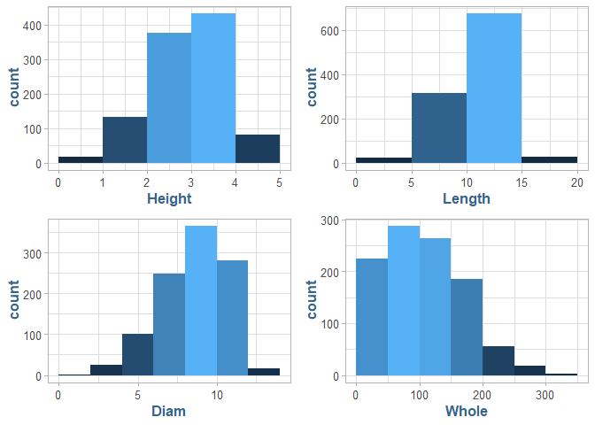<!-- -->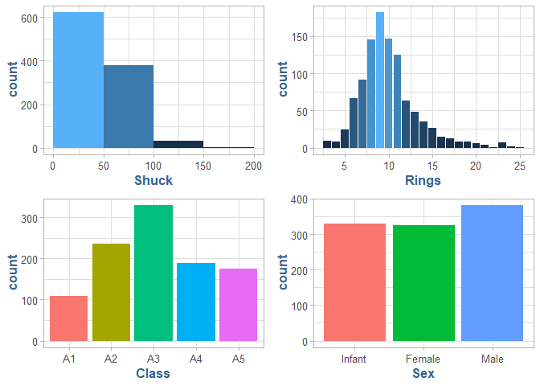<!-- -->

> The base data set contains a total of 8 variables; 5 continuous which are Length, Diameter, Height, Whole and Shuck, 1 discrete variable, Rings, and 
2 categorical variables Sex and Class. Sex is a regular nominal value, ordering doesn?t not apply to this variable in general. The Class variable is a bit more interesting, 
in that is an ordered (Ordinal) level attribute that given to a given abalone based on the Rings attribute.
<br/><br/>
There are also two additional variables we explicitly add to the data for analysis, Volume and Ratio. Both variables are continuous because they are derived from 
multiple underlying continuous variables. Volume is calculated for convince in later analysis from Length, Diameter and Height. Ratio is a continuous measure of the 
shucked weight (meat sans shell), in grams, to the volume of the shell.
<br/><br/>
All continuous variables have well behaved distributions. Height exhibits the most normality, given the shape being approximately symmetric about the mean, Whole and Shuck are 
significantly skewed to the right, to the point they could almost fit an exponential distribution given their sharp descending shape, Shuck prominently display this characteristic. 
Diameter and Length appear to be approximatley normal overall, however, the distribution do have some conciderable outliers, Length in particular. 
<br/><br/>
Sex is evenly distributed with each sex representing approximately a third of the data set as the distribution by sex is approximately uniform. Class is relatively normal, 
with A3 being the dominant Age Class. Rings, the only discrete measure, has a relativly normal shape that is right-skewed.
<br/><br/>
Shuck and Length variables have a high probability of outliers given they have max values over 3 times their respective IQR, 40.99 and 3.57 respectively.
<br/><br/>
The distribution of Rings by Age Class is also curious, as the majority, 64%, of the abalones have between 8 and 12 rings irrespective of their Age Class. 
A disproportionate amount of abalones are also represented by the A3 class with 32%, where we might expect around ~25%, this could be due to a function of harvesting 
limiting older populations, a side-effect of this sample or simply a characteristic of the true population.


### b.) _Sex ~ Class_

__(1 point)__ 

+ Generate a table of counts using __SEX__ and __CLASS__.

+ _Add margins to this table (Hint: There should be 15 cells in this table plus the marginal totals_.

+ Apply *table()* first, then pass the table object to *addmargins()* (Kabacoff Section 7.2 pages 144-147)).

+ Lastly, present a barplot of these data; ignoring the marginal totals.  

<table class="table table-striped" style="margin-left: auto; margin-right: auto;">
<caption>Sex ~ Class</caption>
 <thead>
  <tr>
   <th style="text-align:left;">   </th>
   <th style="text-align:right;"> A1 </th>
   <th style="text-align:right;"> A2 </th>
   <th style="text-align:right;"> A3 </th>
   <th style="text-align:right;"> A4 </th>
   <th style="text-align:right;"> A5 </th>
   <th style="text-align:right;"> Sum </th>
  </tr>
 </thead>
<tbody>
  <tr>
   <td style="text-align:left;"> Infant </td>
   <td style="text-align:right;"> 91 </td>
   <td style="text-align:right;"> 133 </td>
   <td style="text-align:right;"> 65 </td>
   <td style="text-align:right;"> 21 </td>
   <td style="text-align:right;"> 19 </td>
   <td style="text-align:right;"> 329 </td>
  </tr>
  <tr>
   <td style="text-align:left;"> Female </td>
   <td style="text-align:right;"> 5 </td>
   <td style="text-align:right;"> 41 </td>
   <td style="text-align:right;"> 121 </td>
   <td style="text-align:right;"> 82 </td>
   <td style="text-align:right;"> 77 </td>
   <td style="text-align:right;"> 326 </td>
  </tr>
  <tr>
   <td style="text-align:left;"> Male </td>
   <td style="text-align:right;"> 12 </td>
   <td style="text-align:right;"> 62 </td>
   <td style="text-align:right;"> 143 </td>
   <td style="text-align:right;"> 85 </td>
   <td style="text-align:right;"> 79 </td>
   <td style="text-align:right;"> 381 </td>
  </tr>
  <tr>
   <td style="text-align:left;"> Sum </td>
   <td style="text-align:right;"> 108 </td>
   <td style="text-align:right;"> 236 </td>
   <td style="text-align:right;"> 329 </td>
   <td style="text-align:right;"> 188 </td>
   <td style="text-align:right;"> 175 </td>
   <td style="text-align:right;"> 1036 </td>
  </tr>
</tbody>
</table>

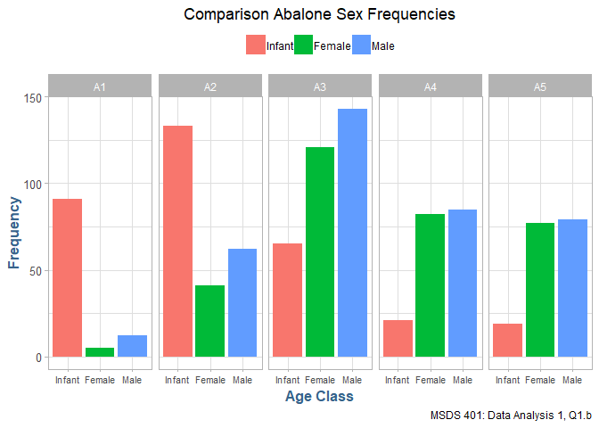<!-- -->

__Question (2 points):__ 

> Discuss the sex distribution of abalones. What stands out about the distribution of abalones by CLASS?

__Answer:__

> In the breakdown of Age Class by Sex we see an expected rise in the counts of Male and Female with a corresponding drop in Infants up until the A3 Class, 
where there is a cross the board drop in abalones in both A4 and A5 (although the relative change in A4 and A5 is miniscule.
<br/><br/>
The curious part of the above data is the persistance of Infants throughout all five Age Classes. Intuitivly, one would think they would drop off after A3, 
turning either Male or Female. This could also be a function of how Sex is classified in abalone. As previously mentioned, the universal drop in A4 and A5 could 
be due to harvesting or the sampling technique.

### c.) _Sample Statistics_

__(1 point)__

+ Select a simple random sample of 200 observations from "__mydata__" and identify this sample as "__work__." 
+ Use *set.seed(123)* prior to drawing this sample. __Do not change the number 123__.
+ Note that *sample()* "takes a sample of the specified size from the elements of x." We cannot sample directly from "mydata." 
    Instead, we need to sample from the integers, 1 to 1036, representing the rows of "mydata." 
    Then, select those rows from the data frame (Kabacoff Section 4.10.5 page 87). 

__Using "work", construct a scatterplot matrix of variables 2-6 with *plot(work[, 2:6])*__
 
_(these are the continuous variables excluding VOLUME and RATIO). The sample "work" will not be used in the remainder of the assignment._

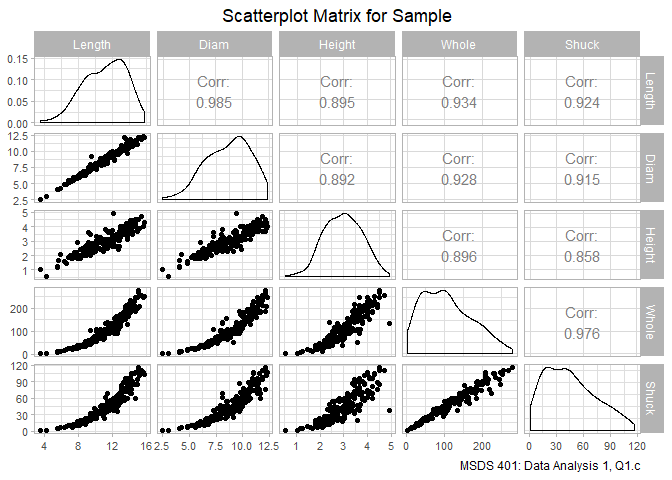<!-- -->

-----

## 2.) __Growth Patterns__

### a.) _Whole ~ Volume_

__(1 point)__

Use "mydata" to plot __WHOLE__ versus __VOLUME__. Color code data points by __CLASS__.

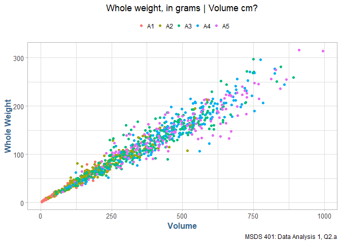<!-- -->


### b.) Shuck ~ Whole

__(2 points)__

+ Use "mydata" to plot SHUCK versus WHOLE with WHOLE on the horizontal axis. 
+ Color code data points by CLASS. 
+ As an aid to interpretation, determine the maximum value of the ratio of SHUCK to WHOLE.
+ Add to the chart a straight line with zero intercept using this maximum value as the slope of the line. 
+ If you are using the 'base R' *plot()* function, you may use *abline()* to add this line to the plot. Use *help(abline)* in R to determine the coding for the 
    slope and intercept arguments in the functions. 
    If you are using ggplot2 for visualizations, *geom_abline()* should be used.

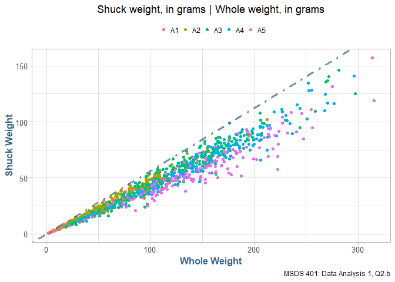<!-- -->

__Question (2 points):__

> How does the variability in this plot differ from the plot in __(a)__?  
Compare the two displays.  Keep in mind that SHUCK is a part of WHOLE. 
Consider the location of the different age classes.

__Answer:__

> There is a strong correlation between whole and shuck, __.973__, as we also saw this behavior in the sample statitics section, which is intuitive as Whole Wieght is composed from Shuck Weight. 
The overall relationship in both charts is strongly linear.
<br/><br/>
The variability is noticeably larger between Whole Weight and Volume than in Shuck Weight to Whole Weight. The data points in Shuck | Whole tend to be more 
normally distributed above and below the mean and approximately symmetrical, where as Whole Weight to Volume has a strong positive skew mean the distribution would have a long right tail,
where Whole to Volume would be a more symmetric normal shape, sans some obvious outliers.
<br/><br/>
Additionally, I colored the points by Age Class and the dominant outliers in both sets are dominant in the A4 and A5 Age Class. This could be a naturally occuring phenomenon as 
abalones age, they will have unique size characteristics based on their genetics.
<br/><br/>
It is interesting to note that the maximum weight, whole (109.25) and shuck (51.25), in A1 confines this age classes into basically the lower quarter of both displays. The rest
of the abalone in classes A2-A5 are distributed pretty randomly above these thresholds.

Whole ~ Shuck Correlation: 0.973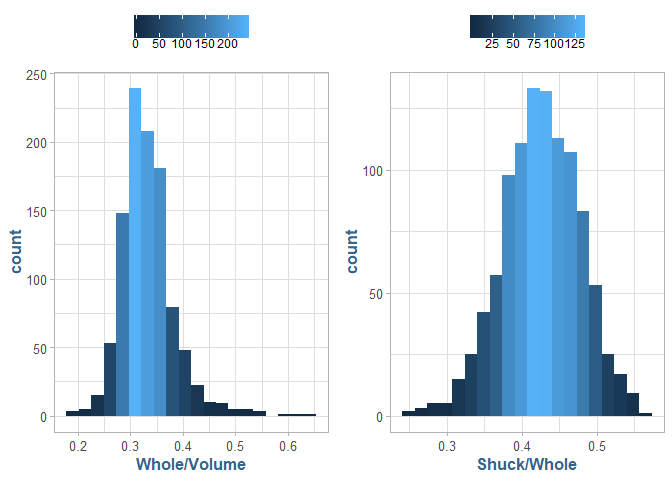<!-- --><table class="table table-striped table-hover" style="margin-left: auto; margin-right: auto;">
<caption>Max Weight by Age Class</caption>
 <thead>
  <tr>
   <th style="text-align:left;"> Class </th>
   <th style="text-align:right;"> Whole </th>
   <th style="text-align:right;"> Shuck </th>
  </tr>
 </thead>
<tbody>
  <tr>
   <td style="text-align:left;"> A1 </td>
   <td style="text-align:right;"> 109.25 </td>
   <td style="text-align:right;"> 51.25 </td>
  </tr>
  <tr>
   <td style="text-align:left;"> A2 </td>
   <td style="text-align:right;"> 212.56 </td>
   <td style="text-align:right;"> 102.16 </td>
  </tr>
  <tr>
   <td style="text-align:left;"> A5 </td>
   <td style="text-align:right;"> 315.75 </td>
   <td style="text-align:right;"> 157.08 </td>
  </tr>
  <tr>
   <td style="text-align:left;"> A3 </td>
   <td style="text-align:right;"> 297.62 </td>
   <td style="text-align:right;"> 146.01 </td>
  </tr>
  <tr>
   <td style="text-align:left;"> A4 </td>
   <td style="text-align:right;"> 296.25 </td>
   <td style="text-align:right;"> 140.81 </td>
  </tr>
</tbody>
</table>

-----

## 3.) Sex Characteristics

### a.) Normality
__(2 points)__

+ Use "mydata" to create a multi-figured plot with histograms, boxplots and Q-Q plots of RATIO differentiated by sex. 
+ This can be done using *par(mfrow = c(3,3))* and base R or *grid.arrange()* and ggplot2.
+ The first row would show the histograms, the second row the boxplots and the third row the Q-Q plots. 
+ Be sure these displays are legible.  

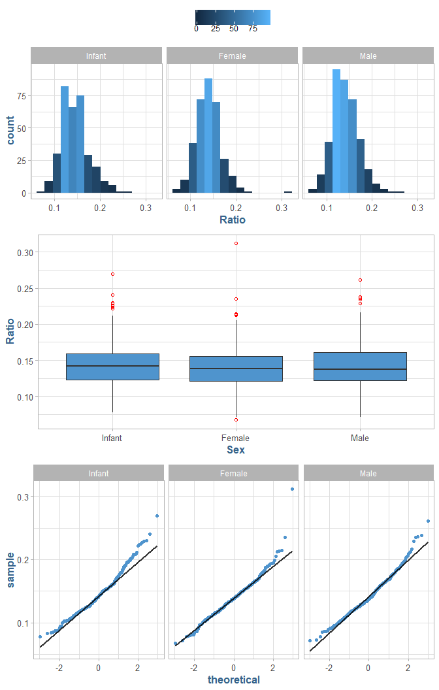<!-- -->

__Question (2 points):__ 

> Compare the displays. How do the distributions compare to normality? Take into account the criteria discussed in the sync sessions to evaluate non-normality.

__Answer:__

> The Ratio variable is a well-behaved distribution between the sexes of abalone. All three sexes have a slightly right-skew to their distributions, and even though
the majority of the data is clustered about the mean in a normal fashion, there are a considerable amount of outliers in these data.
<br/><br/>
The boxplot and QQ-plots do a good job of pointing out the outliers in the sample. The QQ for female is interesting as it follows basically a straight line until the
presents of outliers start to show at around 1.75, then outliers begin to form frequently. Suprisingly, Infants have the most deviated distribution, having outliers
in both positive and negative directions. This could be attributed to the older, A4 and A5 Class Infants, as one would expect a lower deviation in younger specimen.

<table class="table table-striped table-hover" style="margin-left: auto; margin-right: auto;">
<caption>Shapiro-Wilk Normality Test for Normality, 0.05 level</caption>
 <thead>
  <tr>
   <th style="text-align:left;"> Sex </th>
   <th style="text-align:right;"> w </th>
   <th style="text-align:right;"> p </th>
   <th style="text-align:left;"> Result </th>
  </tr>
 </thead>
<tbody>
  <tr>
   <td style="text-align:left;"> Infant </td>
   <td style="text-align:right;"> 0.96962 </td>
   <td style="text-align:right;"> 0e+00 </td>
   <td style="text-align:left;"> Reject Null </td>
  </tr>
  <tr>
   <td style="text-align:left;"> Female </td>
   <td style="text-align:right;"> 0.96028 </td>
   <td style="text-align:right;"> 0e+00 </td>
   <td style="text-align:left;"> Reject Null </td>
  </tr>
  <tr>
   <td style="text-align:left;"> Male </td>
   <td style="text-align:right;"> 0.98031 </td>
   <td style="text-align:right;"> 5e-05 </td>
   <td style="text-align:left;"> Reject Null </td>
  </tr>
</tbody>
</table>

> The Shapiro-Wilk test on the Ratio variable by Sex shows that we should reject the null hypothesis that these data came from a normal distribution, so
the chance is small that these data came from a truly normally distribution.

### b.) Outliers
__(2 points)__

+ Use the boxplots to identify RATIO outliers (mild and extreme both) for each sex.
+ Present the abalones with these outlying RATIO values along with their associated variables in "mydata"

_(Hint:display the observations by passing a data frame to the kable() function)._

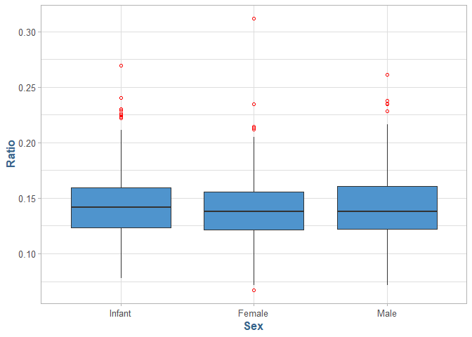<!-- --><table class="table table-striped table-hover" style="margin-left: auto; margin-right: auto;">
<caption>Abalones with Mild Outlier Ratio Values</caption>
 <thead>
  <tr>
   <th style="text-align:left;"> Sex </th>
   <th style="text-align:right;"> Length </th>
   <th style="text-align:right;"> Diam </th>
   <th style="text-align:right;"> Height </th>
   <th style="text-align:right;"> Whole </th>
   <th style="text-align:right;"> Shuck </th>
   <th style="text-align:right;"> Rings </th>
   <th style="text-align:left;"> Class </th>
   <th style="text-align:right;"> Volume </th>
   <th style="text-align:right;"> Ratio </th>
  </tr>
 </thead>
<tbody>
  <tr>
   <td style="text-align:left;"> Infant </td>
   <td style="text-align:right;"> 10.08 </td>
   <td style="text-align:right;"> 7.35 </td>
   <td style="text-align:right;"> 2.21 </td>
   <td style="text-align:right;"> 79.38 </td>
   <td style="text-align:right;"> 44.00 </td>
   <td style="text-align:right;"> 6 </td>
   <td style="text-align:left;"> A1 </td>
   <td style="text-align:right;"> 163.36 </td>
   <td style="text-align:right;"> 0.27 </td>
  </tr>
  <tr>
   <td style="text-align:left;"> Infant </td>
   <td style="text-align:right;"> 4.30 </td>
   <td style="text-align:right;"> 3.25 </td>
   <td style="text-align:right;"> 0.94 </td>
   <td style="text-align:right;"> 6.19 </td>
   <td style="text-align:right;"> 2.94 </td>
   <td style="text-align:right;"> 3 </td>
   <td style="text-align:left;"> A1 </td>
   <td style="text-align:right;"> 13.24 </td>
   <td style="text-align:right;"> 0.22 </td>
  </tr>
  <tr>
   <td style="text-align:left;"> Infant </td>
   <td style="text-align:right;"> 2.84 </td>
   <td style="text-align:right;"> 2.73 </td>
   <td style="text-align:right;"> 0.84 </td>
   <td style="text-align:right;"> 3.62 </td>
   <td style="text-align:right;"> 1.56 </td>
   <td style="text-align:right;"> 4 </td>
   <td style="text-align:left;"> A1 </td>
   <td style="text-align:right;"> 6.50 </td>
   <td style="text-align:right;"> 0.24 </td>
  </tr>
  <tr>
   <td style="text-align:left;"> Infant </td>
   <td style="text-align:right;"> 6.72 </td>
   <td style="text-align:right;"> 4.30 </td>
   <td style="text-align:right;"> 1.68 </td>
   <td style="text-align:right;"> 22.62 </td>
   <td style="text-align:right;"> 11.00 </td>
   <td style="text-align:right;"> 5 </td>
   <td style="text-align:left;"> A1 </td>
   <td style="text-align:right;"> 48.60 </td>
   <td style="text-align:right;"> 0.23 </td>
  </tr>
  <tr>
   <td style="text-align:left;"> Infant </td>
   <td style="text-align:right;"> 5.04 </td>
   <td style="text-align:right;"> 3.67 </td>
   <td style="text-align:right;"> 0.94 </td>
   <td style="text-align:right;"> 9.66 </td>
   <td style="text-align:right;"> 3.94 </td>
   <td style="text-align:right;"> 5 </td>
   <td style="text-align:left;"> A1 </td>
   <td style="text-align:right;"> 17.50 </td>
   <td style="text-align:right;"> 0.22 </td>
  </tr>
  <tr>
   <td style="text-align:left;"> Infant </td>
   <td style="text-align:right;"> 3.36 </td>
   <td style="text-align:right;"> 2.31 </td>
   <td style="text-align:right;"> 0.52 </td>
   <td style="text-align:right;"> 2.44 </td>
   <td style="text-align:right;"> 0.94 </td>
   <td style="text-align:right;"> 4 </td>
   <td style="text-align:left;"> A1 </td>
   <td style="text-align:right;"> 4.07 </td>
   <td style="text-align:right;"> 0.23 </td>
  </tr>
  <tr>
   <td style="text-align:left;"> Infant </td>
   <td style="text-align:right;"> 6.93 </td>
   <td style="text-align:right;"> 4.72 </td>
   <td style="text-align:right;"> 1.57 </td>
   <td style="text-align:right;"> 23.38 </td>
   <td style="text-align:right;"> 11.81 </td>
   <td style="text-align:right;"> 7 </td>
   <td style="text-align:left;"> A2 </td>
   <td style="text-align:right;"> 51.57 </td>
   <td style="text-align:right;"> 0.23 </td>
  </tr>
  <tr>
   <td style="text-align:left;"> Infant </td>
   <td style="text-align:right;"> 9.13 </td>
   <td style="text-align:right;"> 6.30 </td>
   <td style="text-align:right;"> 2.52 </td>
   <td style="text-align:right;"> 74.56 </td>
   <td style="text-align:right;"> 32.38 </td>
   <td style="text-align:right;"> 8 </td>
   <td style="text-align:left;"> A2 </td>
   <td style="text-align:right;"> 145.03 </td>
   <td style="text-align:right;"> 0.22 </td>
  </tr>
  <tr>
   <td style="text-align:left;"> Female </td>
   <td style="text-align:right;"> 7.98 </td>
   <td style="text-align:right;"> 6.72 </td>
   <td style="text-align:right;"> 2.42 </td>
   <td style="text-align:right;"> 80.94 </td>
   <td style="text-align:right;"> 40.38 </td>
   <td style="text-align:right;"> 7 </td>
   <td style="text-align:left;"> A2 </td>
   <td style="text-align:right;"> 129.51 </td>
   <td style="text-align:right;"> 0.31 </td>
  </tr>
  <tr>
   <td style="text-align:left;"> Female </td>
   <td style="text-align:right;"> 11.55 </td>
   <td style="text-align:right;"> 7.98 </td>
   <td style="text-align:right;"> 3.46 </td>
   <td style="text-align:right;"> 150.62 </td>
   <td style="text-align:right;"> 68.55 </td>
   <td style="text-align:right;"> 10 </td>
   <td style="text-align:left;"> A3 </td>
   <td style="text-align:right;"> 319.37 </td>
   <td style="text-align:right;"> 0.21 </td>
  </tr>
  <tr>
   <td style="text-align:left;"> Female </td>
   <td style="text-align:right;"> 11.45 </td>
   <td style="text-align:right;"> 8.09 </td>
   <td style="text-align:right;"> 3.15 </td>
   <td style="text-align:right;"> 139.81 </td>
   <td style="text-align:right;"> 68.49 </td>
   <td style="text-align:right;"> 9 </td>
   <td style="text-align:left;"> A3 </td>
   <td style="text-align:right;"> 291.48 </td>
   <td style="text-align:right;"> 0.23 </td>
  </tr>
  <tr>
   <td style="text-align:left;"> Female </td>
   <td style="text-align:right;"> 12.18 </td>
   <td style="text-align:right;"> 9.45 </td>
   <td style="text-align:right;"> 4.93 </td>
   <td style="text-align:right;"> 133.88 </td>
   <td style="text-align:right;"> 38.25 </td>
   <td style="text-align:right;"> 14 </td>
   <td style="text-align:left;"> A5 </td>
   <td style="text-align:right;"> 568.02 </td>
   <td style="text-align:right;"> 0.07 </td>
  </tr>
  <tr>
   <td style="text-align:left;"> Male </td>
   <td style="text-align:right;"> 13.44 </td>
   <td style="text-align:right;"> 10.81 </td>
   <td style="text-align:right;"> 1.68 </td>
   <td style="text-align:right;"> 130.25 </td>
   <td style="text-align:right;"> 63.73 </td>
   <td style="text-align:right;"> 10 </td>
   <td style="text-align:left;"> A3 </td>
   <td style="text-align:right;"> 244.19 </td>
   <td style="text-align:right;"> 0.26 </td>
  </tr>
  <tr>
   <td style="text-align:left;"> Male </td>
   <td style="text-align:right;"> 10.50 </td>
   <td style="text-align:right;"> 7.77 </td>
   <td style="text-align:right;"> 3.15 </td>
   <td style="text-align:right;"> 132.69 </td>
   <td style="text-align:right;"> 61.13 </td>
   <td style="text-align:right;"> 9 </td>
   <td style="text-align:left;"> A3 </td>
   <td style="text-align:right;"> 256.99 </td>
   <td style="text-align:right;"> 0.24 </td>
  </tr>
  <tr>
   <td style="text-align:left;"> Male </td>
   <td style="text-align:right;"> 10.71 </td>
   <td style="text-align:right;"> 8.61 </td>
   <td style="text-align:right;"> 3.25 </td>
   <td style="text-align:right;"> 160.31 </td>
   <td style="text-align:right;"> 70.41 </td>
   <td style="text-align:right;"> 9 </td>
   <td style="text-align:left;"> A3 </td>
   <td style="text-align:right;"> 300.15 </td>
   <td style="text-align:right;"> 0.23 </td>
  </tr>
  <tr>
   <td style="text-align:left;"> Male </td>
   <td style="text-align:right;"> 12.29 </td>
   <td style="text-align:right;"> 9.87 </td>
   <td style="text-align:right;"> 3.46 </td>
   <td style="text-align:right;"> 176.12 </td>
   <td style="text-align:right;"> 99.00 </td>
   <td style="text-align:right;"> 10 </td>
   <td style="text-align:left;"> A3 </td>
   <td style="text-align:right;"> 420.14 </td>
   <td style="text-align:right;"> 0.24 </td>
  </tr>
  <tr>
   <td style="text-align:left;"> Male </td>
   <td style="text-align:right;"> 11.55 </td>
   <td style="text-align:right;"> 8.82 </td>
   <td style="text-align:right;"> 3.36 </td>
   <td style="text-align:right;"> 167.56 </td>
   <td style="text-align:right;"> 78.27 </td>
   <td style="text-align:right;"> 10 </td>
   <td style="text-align:left;"> A3 </td>
   <td style="text-align:right;"> 342.29 </td>
   <td style="text-align:right;"> 0.23 </td>
  </tr>
  <tr>
   <td style="text-align:left;"> Male </td>
   <td style="text-align:right;"> 11.45 </td>
   <td style="text-align:right;"> 8.61 </td>
   <td style="text-align:right;"> 2.52 </td>
   <td style="text-align:right;"> 99.12 </td>
   <td style="text-align:right;"> 53.71 </td>
   <td style="text-align:right;"> 9 </td>
   <td style="text-align:left;"> A3 </td>
   <td style="text-align:right;"> 248.32 </td>
   <td style="text-align:right;"> 0.22 </td>
  </tr>
</tbody>
</table>

<table class="table table-striped table-hover" style="margin-left: auto; margin-right: auto;">
<caption>Abalones with Extreme Outlier Ratio Values</caption>
 <thead>
  <tr>
   <th style="text-align:left;"> Sex </th>
   <th style="text-align:right;"> Length </th>
   <th style="text-align:right;"> Diam </th>
   <th style="text-align:right;"> Height </th>
   <th style="text-align:right;"> Whole </th>
   <th style="text-align:right;"> Shuck </th>
   <th style="text-align:right;"> Rings </th>
   <th style="text-align:left;"> Class </th>
   <th style="text-align:right;"> Volume </th>
   <th style="text-align:right;"> Ratio </th>
  </tr>
 </thead>
<tbody>
  <tr>
   <td style="text-align:left;"> Infant </td>
   <td style="text-align:right;"> 10.08 </td>
   <td style="text-align:right;"> 7.35 </td>
   <td style="text-align:right;"> 2.21 </td>
   <td style="text-align:right;"> 79.38 </td>
   <td style="text-align:right;"> 44.00 </td>
   <td style="text-align:right;"> 6 </td>
   <td style="text-align:left;"> A1 </td>
   <td style="text-align:right;"> 163.36 </td>
   <td style="text-align:right;"> 0.27 </td>
  </tr>
  <tr>
   <td style="text-align:left;"> Female </td>
   <td style="text-align:right;"> 7.98 </td>
   <td style="text-align:right;"> 6.72 </td>
   <td style="text-align:right;"> 2.42 </td>
   <td style="text-align:right;"> 80.94 </td>
   <td style="text-align:right;"> 40.38 </td>
   <td style="text-align:right;"> 7 </td>
   <td style="text-align:left;"> A2 </td>
   <td style="text-align:right;"> 129.51 </td>
   <td style="text-align:right;"> 0.31 </td>
  </tr>
</tbody>
</table>

__Question (2 points):__

> What are your observations regarding the results in __(3)(b)__?

__Answer:__

> The Ratio boxplot by Sex highlights the dominance of outliers in the Infant abalones. Almost half of the total mild outliers belong to the Infants, almost as much as
male and female combined. Interestingly, the detailed display here is helpful in that none of the outliers are in the A4 or A5 class, which is suprising to me. The Infant outliers
are 75% A1, which could be derived from the variability amoung different species of abalone Infants. Notably, both of the exreme outliers are in A1/A2 as well; highlighting 
the variability among younger abalone.
<br/><br/>
In the Male and Female samples we see that the mild outliers are concentrated in the A3 Age Class.

-----

## 4.) Growth Prediction

### a.) Size ~ Rings
(3 points) 

With "mydata," 

+ display side-by-side boxplots for __VOLUME__ and __WHOLE__, each differentiated by CLASS (_Davies Section 14.3.2_). 
There should be five boxes for __VOLUME__ and five for __WHOLE__. 
+ Also, display side-by-side scatterplots:  __VOLUME__ and __WHOLE__ versus __RINGS__. 

_Present these four figures in one graphic:  the boxplots in one row and the scatterplots in a second row. Base R or ggplot2 may be used._


<!-- -->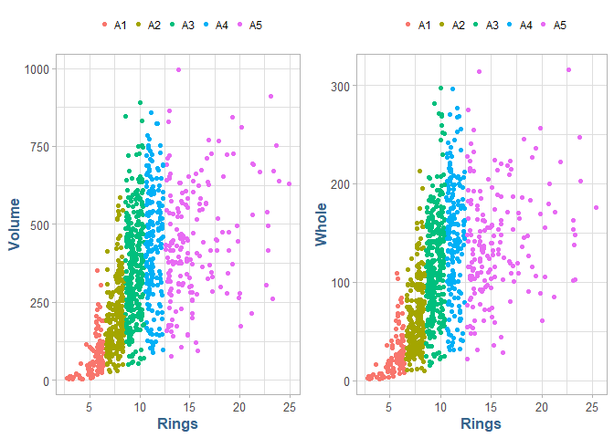<!-- -->

__Question (5 points):__ 

How well do you think these variables would perform as predictors of age?  __Explain.__

> If we break down the distribution of Volume and Whole weight by Age Class we can see a lot of clustering around the mean, however, the data
has an abundance of outliers in every regard. The A1 Age Class in particular is wildly distributed, having a narrow IQR and several noticeable outliers.
The overall variablility seems to stabilize somewhat in A3 continuing linearly into A4 where the mean peaks, then a downward trend into A5, although the existance of so many
outliers makes it difficult so see any clear patterns.
<br/><br/>
Color coding the scatter plot in __4b__ by Age Class helps us to see the clusting of Volume/Whole to Rings by Age Class. The variabliity in both Volume and Whole is evident, 
as the only clear pattern one can disconcern is the relationship between Age Class and Rings, which is not particularly helpful given that _Age Class_ is a function of _Rings_.
<br/><br/>
The overall relationship to both Volume and Whole weight to Age Class is not strong, and I think they would both peform poorly as predictors of Age given the information as provided
due to the abundance of outliers and non-linear relationship to age.

-----

## 5.) Age Characteristics

### a.) Tabular
__(2 points) __

+ Use *aggregate()* with "mydata" to compute the mean values of VOLUME, SHUCK and RATIO for each combination of SEX and CLASS. 
+ Then, using *matrix()*, create matrices of the mean values. 
+ Using the "dimnames" argument within *matrix()* or the *rownames()* and *colnames()* functions on the matrices, label the rows by SEX and columns by CLASS. 
+ Present the three matrices (Kabacoff Section 5.6.2, p. 110-111). The *kable()* function is useful for this purpose.  

_You do not need to be concerned with the number of digits presented._

<table class="table table-striped table-hover" style="margin-left: auto; margin-right: auto;">
<caption>Volume</caption>
 <thead>
  <tr>
   <th style="text-align:left;"> Sex </th>
   <th style="text-align:right;"> A1 </th>
   <th style="text-align:right;"> A2 </th>
   <th style="text-align:right;"> A3 </th>
   <th style="text-align:right;"> A4 </th>
   <th style="text-align:right;"> A5 </th>
  </tr>
 </thead>
<tbody>
  <tr>
   <td style="text-align:left;"> Infant </td>
   <td style="text-align:right;"> 66.516 </td>
   <td style="text-align:right;"> 160.320 </td>
   <td style="text-align:right;"> 270.741 </td>
   <td style="text-align:right;"> 316.413 </td>
   <td style="text-align:right;"> 318.693 </td>
  </tr>
  <tr>
   <td style="text-align:left;"> Female </td>
   <td style="text-align:right;"> 255.299 </td>
   <td style="text-align:right;"> 276.857 </td>
   <td style="text-align:right;"> 412.608 </td>
   <td style="text-align:right;"> 498.049 </td>
   <td style="text-align:right;"> 486.153 </td>
  </tr>
  <tr>
   <td style="text-align:left;"> Male </td>
   <td style="text-align:right;"> 103.723 </td>
   <td style="text-align:right;"> 245.386 </td>
   <td style="text-align:right;"> 358.118 </td>
   <td style="text-align:right;"> 442.616 </td>
   <td style="text-align:right;"> 440.207 </td>
  </tr>
</tbody>
</table>

<table class="table table-striped table-hover" style="margin-left: auto; margin-right: auto;">
<caption>Shuck</caption>
 <thead>
  <tr>
   <th style="text-align:left;"> Sex </th>
   <th style="text-align:right;"> A1 </th>
   <th style="text-align:right;"> A2 </th>
   <th style="text-align:right;"> A3 </th>
   <th style="text-align:right;"> A4 </th>
   <th style="text-align:right;"> A5 </th>
  </tr>
 </thead>
<tbody>
  <tr>
   <td style="text-align:left;"> Infant </td>
   <td style="text-align:right;"> 10.113 </td>
   <td style="text-align:right;"> 23.410 </td>
   <td style="text-align:right;"> 37.180 </td>
   <td style="text-align:right;"> 39.854 </td>
   <td style="text-align:right;"> 36.470 </td>
  </tr>
  <tr>
   <td style="text-align:left;"> Female </td>
   <td style="text-align:right;"> 38.900 </td>
   <td style="text-align:right;"> 42.503 </td>
   <td style="text-align:right;"> 59.691 </td>
   <td style="text-align:right;"> 69.052 </td>
   <td style="text-align:right;"> 59.171 </td>
  </tr>
  <tr>
   <td style="text-align:left;"> Male </td>
   <td style="text-align:right;"> 16.396 </td>
   <td style="text-align:right;"> 38.339 </td>
   <td style="text-align:right;"> 52.969 </td>
   <td style="text-align:right;"> 61.427 </td>
   <td style="text-align:right;"> 55.028 </td>
  </tr>
</tbody>
</table>

<table class="table table-striped table-hover" style="margin-left: auto; margin-right: auto;">
<caption>Ratio</caption>
 <thead>
  <tr>
   <th style="text-align:left;"> Sex </th>
   <th style="text-align:right;"> A1 </th>
   <th style="text-align:right;"> A2 </th>
   <th style="text-align:right;"> A3 </th>
   <th style="text-align:right;"> A4 </th>
   <th style="text-align:right;"> A5 </th>
  </tr>
 </thead>
<tbody>
  <tr>
   <td style="text-align:left;"> Infant </td>
   <td style="text-align:right;"> 0.157 </td>
   <td style="text-align:right;"> 0.148 </td>
   <td style="text-align:right;"> 0.137 </td>
   <td style="text-align:right;"> 0.124 </td>
   <td style="text-align:right;"> 0.117 </td>
  </tr>
  <tr>
   <td style="text-align:left;"> Female </td>
   <td style="text-align:right;"> 0.155 </td>
   <td style="text-align:right;"> 0.155 </td>
   <td style="text-align:right;"> 0.145 </td>
   <td style="text-align:right;"> 0.138 </td>
   <td style="text-align:right;"> 0.123 </td>
  </tr>
  <tr>
   <td style="text-align:left;"> Male </td>
   <td style="text-align:right;"> 0.151 </td>
   <td style="text-align:right;"> 0.156 </td>
   <td style="text-align:right;"> 0.146 </td>
   <td style="text-align:right;"> 0.136 </td>
   <td style="text-align:right;"> 0.126 </td>
  </tr>
</tbody>
</table>

### b.) Graphical
__(3 points)__

Present three graphs. Each graph should include three lines, one for each sex. 

+ The first should show mean RATIO versus CLASS; 
+ the second, mean VOLUME versus CLASS; 
+ the third, mean SHUCK versus CLASS. 

_This may be done with the 'base R' *interaction.plot()* function or with ggplot2 using *grid.arrange()*._

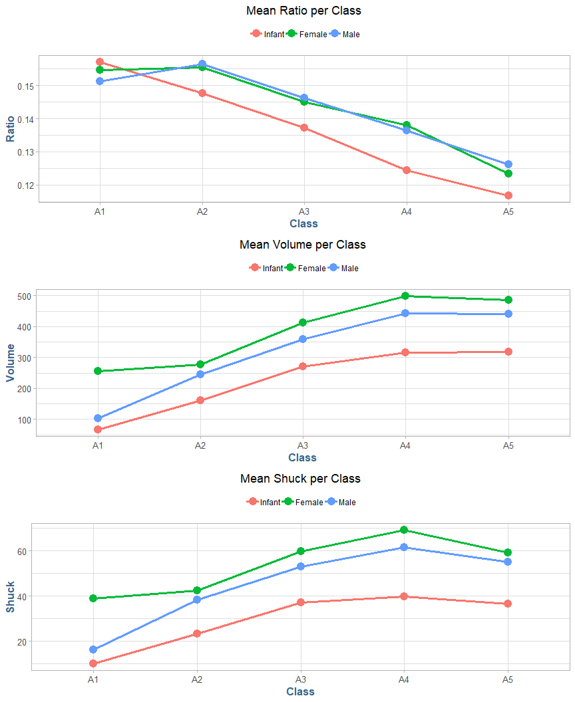<!-- -->

__Question (2 points):__
_What questions do these plots raise?  Consider aging and sex differences._

> From the first plot of __Ratio__ to Age Class, I find it interesting that between A1 and A2, we see an increase in both Male and Female, but a
sharp decline in Infants. Perhaps this has something to do with reproduction in young abalone? The strong universal decent in Ratio after A2 is
basically identical between all Sexes otherwise if you account for the Offset jump with Males and Females in A1-A2.
<br/><br/>
Looking at __Volume__, it is interesting that Males have the lowest increase over the interval from A1-A2 expecially relative to Females and Infants, 
howevever, have the overall largest volume irrespective of Sex.
<br/><br/>
In looking at __Shuck__ to Class, it is interesting to note the strong linear relationship between Shuck and Volume by Sex, at least until A5 when there is an expecially 
steep decline in Shuck for both Males and Females. The two charts would essentially overlap if you laid them on top of each other for the range A1-A4. These could 
possibly be canidates for predictors of each other, would have to explore further.
<br/><br/>
Additionally, the fact that the shuck weight lowers in A4-A5 while the Volume stays relatively the same suggests that perhaps the actual abalone begin to shrink in older
age, given the fact that they stay inside the same shell throughout their life.

### c.) Infant ~ Adult
(3 points) 

Present four boxplots using *par(mfrow = c(2, 2)* or *grid.arrange()*. 

+ The first line should show VOLUME by RINGS for the infants and, separately, for the adult; factor levels "M" and "F," combined. 
+ The second line should show WHOLE by RINGS for the infants and, separately, for the adults. 
+ Since the data are sparse beyond 15 rings, limit the displays to less than 16 rings. 
+ One way to accomplish this is to generate a new data set using subset() to select RINGS < 16.  Use ylim = c(0, 1100) for VOLUME and ylim = c(0, 400) for WHOLE.  

_If you wish to reorder the displays for presentation purposes or use ggplot2 go ahead._

<!-- -->

__Question (2 points):__ 

_What do these displays suggest about abalone growth?  Also, compare the infant and adult displays.  What differences stand out?_

> These displays suggest that abalones have a similar growth pattern throughout their life. Both classifications of abalone demonstrate a clear linear
growth trend until they hit an inflection point, around ~10-12 rings, in which they start to decline in size by both volume and whole weight. This further suggests that as
abalone age they either shrink, or perhaps a side-effect of harvesting where larger abalone are taken from the population leaving only smaller samples to develop
the upper end of the ring range.
<br/><br/>
The infants have an interesting characteristic in that at ~12 rings, there is an extremely large cluster of abalone relative to every other ring
point. Notably, there are almost no adults with fewer than 6 rings, which suggests that at around 6 rings many abalone become either male or female. That
does not explain the clear persistence of infant abalone with 8-12 rings, which is about 66% of all infant abalones.
<br/><br/>
The clearest difference between infant and adult abalone is the variance in size amongst the two groups per ring count. Infant abalone with 7-9 rings have a large variance,
the rest of the ring categories are tightly clustered around the mean. While adult abalone have wild variance at every ring count where there is any significant portion, i.e., 6 rings or more.

__Reference__

Infant abalone with between 6 and 12 rings : 65.84

-----

## Conclusions

Please respond to each of the following questions (10 points total):

### 1.) Study Observations
__(5 points)__

_Based solely on these data, what are plausible statistical reasons that explain the failure of the original study?_
_Consider to what extent physical measurements may be used for age prediction._

> It is not surprising to me that the original study failed to produce an accurate predictor of age from physical measurements given the characteristics of the data explore in this assignment. Initial 
inspection of the overall summary of the sample provided at the beginning of this study suggest we have a relatively ?good? sample of data. There is not an abundance of outliners in any 
metric, the sample is evenly distributed between age class and sex. The continuous variables all have well behaved distribution characteristics and the random sample from our initial population 
conformed approximately to the overall dataset.
<br/><br/>
Abalone growth patterns as they relate to age class do not have an obvious relationship. As we saw in the ?Growth Patterns? section in this study, we noted that abalone that have weight 
over ~109.25 whole or ~51.25 shucked, are essentially randomly distributed above this area with no apparent commonality.
<br/><br/>
Taking a deeper look at abalones by their physical age classifier, rings, we also noted similar behavior. Abalone physical metrics like volume and whole weight by ring size seems to be 
stochastically distributed. We see abalones with less than 6 rings, tend to weigh less than ~100 grams, and after that we see that abalones weighing over ~100 grams can have anywhere 
between 7 and 25 rings with no apparent relationship. This behavior is similar with the total volume of a given abalone.
<br/><br/>
Sex is another interesting characteristic in that while infant and adult abalone have some measure of distinguishability, particularly at younger age classifications, as abalone age the 
overall variability in their size continues to increase. We can see a relatively clear classification of abalone infants and adults when they have under 6 rings, however, 
after that point it becomes difficult to distinguish based on any physical measurement.

### 2.) Sample Statistics
__(3 points)__

_Do not refer to the abalone data or study._

If you were presented with an overall histogram and summary statistics from a sample of some population or phenomenon and no other information, 
what questions might you ask before accepting them as representative of the sampled population or phenomenon?

__Answer__:

> I would ask: 

+ What evidence do you have and what associated test have been performed to prove that the sample is representative of the overall population?
+ How did they derive this sample? 
+ What methodologies did your study implement as part of sample collection? 
+ What measures did you take to ensure that there is no inherit bias in the collected sample?
+ Has this sample been reproduced successfully outside your initial conditions?
+ What are some potential counfounding variables that attribute to these statistics? 

### 3.) Observational Studies
__(2 points)__

_Do not refer to the abalone data or study._

What do you see as difficulties analyzing data derived from observational studies? 
Can causality be determined?
What might be learned from such studies?

__Answer:__

> From observational studies it is difficult to know how well the sample truly represents the larger population. This kind of study can raise many questions that the data at hand cannot 
adequately answer. We can run several sets of summary statistics on our sample, however, we are unable to know if the sample was collected in a way that bias the data, thereby 
invaliding our observational study.
<br/><br/>
For example, the entire data set could have been collected under the influence of a confounding factor, thereby tilting our conclusions. There is also a factor of random 
error in every study, and it is difficult, if not impossible, to account for such occurrences; we can only execute the study to the mathematical rigors of our discipline and hope they we 
catch such errors through validation and peer review.
