# Alternative Assignment Items

__(50 points total)__

## 1.) Normality 

> Skewness and kurtosis statistics are used to assess normality or lack thereof. These statistics are affected by distributional shape and sample size. 
This exercise will investigate how variable the skewness and kurtosis statistics are when sampling from a standard normal distribution. 

+ The results will provide a baseline for evaluating data samples in the future. 
+ The skewness for the standard normal distribution is 0.0. 
+ The kurtosis for the standard normal distribution is 3.0. 

_Samples from a normal distribution will depart from these values._

The function defined below may be used to generate the samples for a given *n*. This function produces a 1000 x *n* dimensional array. Use three different samples size:  10, 40 and 160.


```r
generate <- function(n){
  set.seed(123)
  result <- matrix(0, nrow = 1000, ncol = n)
  for (k in 1:1000) {
    result[k, ] <- rnorm(n, mean = 0, sd = 1)
  }
  return(result)
}

sample10 <- generate(10)
sample40 <- generate(40)
sample160 <-generate(160)
```


```r
# Utility function for part a and b.

getValueHist <- function(data, desc, cap) {

	lower_q <- quantile(data$Value, 0.025)
    upper_q <- quantile(data$Value, 0.975)

    ggplot(data, aes(Value, fill = ..count..)) +
		geom_histogram(bins = 15) +
		geom_vline(xintercept = lower_q, linetype = 11, color = "firebrick3") +
		geom_vline(xintercept = upper_q, linetype = 11, color = "firebrick3") +
		geom_rug(aes(x = Value), color = "firebrick", inherit.aes = FALSE) +
		labs(title = paste("Histogram of", desc), caption = cap) +
		theme(axis.text.x = element_text(size = 8))
}
```

### a.) Skewness
__(4 points)__

+ In the following code 'chunk,' you will need to add code passing each 1000 x *n* matrix to an instance of *apply()*. 
+ Your matrices will be passed to *apply()* as X. 
+ You must specify the appropriate MARGIN and FUN to have skewness calculated for each row. 
+ The documentation page for *apply()* describes both arguments and their possible values.

You will present the skewness results for n = 10, 40 and 160 as histograms, determine the 2.5% (0.025) and 97.5% (0.975) quantiles using *quantile()*, and display these quantiles on the histograms.   

+ Then, use the function *sd()* to calculate the sample standard deviation for each of the three vectors of skewnesses.
+ Additionally, the theoretical formula for the standard deviation of skewness based on a random sample from a normal distribution is ```sqrt(6 * (n - 2) / ((n + 1 ) * (n + 3)))```. 
+ Use this formula and compare to the sample standard deviation values. Show both sets of results side by side in a summary table.

Load the "moments" package which supplies *skewness()* and *kurtosis()* functions.


```r
getSkewness <- function(x) { 
    result <- apply(x, MARGIN = 1, FUN = skewness)

	stopifnot(skewness(x[1,]) == result[1])

    data.table( Value = result )
}

theoretical_sd <- function(n) {
	sqrt(6 * (n - 2) / ((n + 1) * (n + 3)))
}

q1a_cap <- "MSDS 401: R Programming 2, Q1.a"

# Skew10
skew10 <- getSkewness(sample10)
skew10.sd <- sd(skew10$Value)
skew10.tsd <- theoretical_sd(10)
getValueHist(skew10, "Skew10", q1a_cap)
```

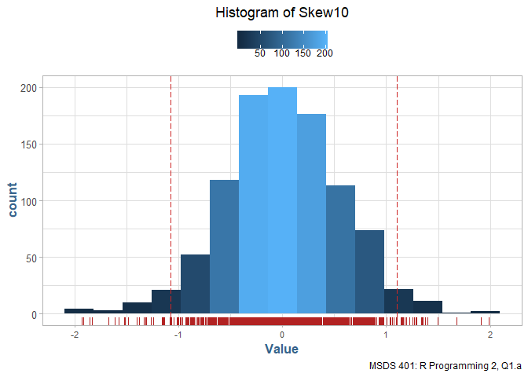<!-- -->

```r
# Skew40
skew40 <- getSkewness(sample40)
skew40.sd <- sd(skew40$Value)
skew40.tsd <- theoretical_sd(40)
getValueHist(skew40, "Skew40", q1a_cap)
```

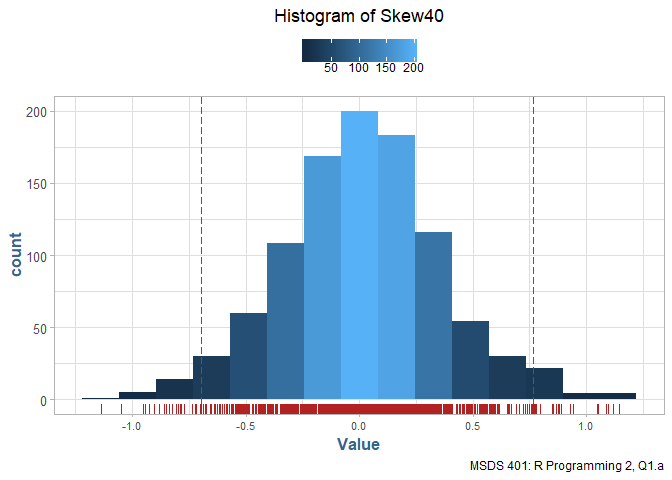<!-- -->

```r
# Skew 160
skew160 <- getSkewness(sample160)
skew160.sd <- sd(skew160$Value)
skew160.tsd <- theoretical_sd(160)
getValueHist(skew160, "Skew160", q1a_cap)
```

<!-- -->

```r
results <- data.table(Size = c(10, 40, 160),
	   StdDev = c(skew10.sd, skew40.sd, skew160.tsd),
       Theoretical = c(skew10.tsd, skew40.tsd, skew160.tsd))

pretty_kable(results, "Standard Deviations of Skewness")
```

<table class="table table-striped table-hover" style="margin-left: auto; margin-right: auto;">
<caption>Standard Deviations of Skewness</caption>
 <thead>
  <tr>
   <th style="text-align:right;"> Size </th>
   <th style="text-align:right;"> StdDev </th>
   <th style="text-align:right;"> Theoretical </th>
  </tr>
 </thead>
<tbody>
  <tr>
   <td style="text-align:right;"> 10 </td>
   <td style="text-align:right;"> 0.56 </td>
   <td style="text-align:right;"> 0.58 </td>
  </tr>
  <tr>
   <td style="text-align:right;"> 40 </td>
   <td style="text-align:right;"> 0.35 </td>
   <td style="text-align:right;"> 0.36 </td>
  </tr>
  <tr>
   <td style="text-align:right;"> 160 </td>
   <td style="text-align:right;"> 0.19 </td>
   <td style="text-align:right;"> 0.19 </td>
  </tr>
</tbody>
</table>

### b.) Kurtosis
__(4 points)__ 

Follow the steps outlined in __(1)(a)__ above for kurtosis. Kurtosis for a standard normal distribution is 3.0 using the "moments" package *kurtosis()* function. 

The theoretical formula for the standard deviation of kurtosis based on a random sample from a normal distribution is ```sqrt(24 * n * (n - 2) * (n - 3) / ((n + 1) * (n + 1) * (n + 3) * (n + 5)))```. 
Using *sd()*, compute the sample standard deviations for the three random samples, and compare to the results you compute using the theoretical formula for the three sample sizes.  
Show both sets of result side by side in a summary table.


```r
getKurtosis <- function(x) {
	result <- apply(x, MARGIN = 1, FUN = kurtosis)

	stopifnot(kurtosis(x[1,]) == result[1])

	data.table(Value = result)
}

theoretical_kt <- function(n) {
	sqrt(24 * n * (n - 2) * (n - 3) / ((n + 1) * (n + 1) * (n + 3) * (n + 5)))
}

q1b_cap <- "MSDS 401: R Programming 2, Q1.b"

# Kurt10
kurt10 <- getKurtosis(sample10)
kurt10.sd <- sd(kurt10$Value)
kurt10.tsd <- theoretical_kt(10)
getValueHist(kurt10, "Kurt10", q1b_cap)
```

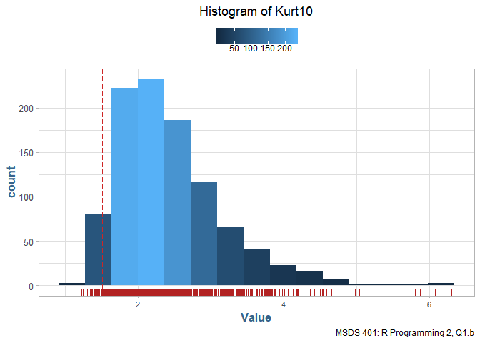<!-- -->

```r
# Kurt40
kurt40 <- getKurtosis(sample40)
kurt40.sd <- sd(kurt40$Value)
kurt40.tsd <- theoretical_kt(40)
getValueHist(kurt40, "Kurt40", q1b_cap)
```

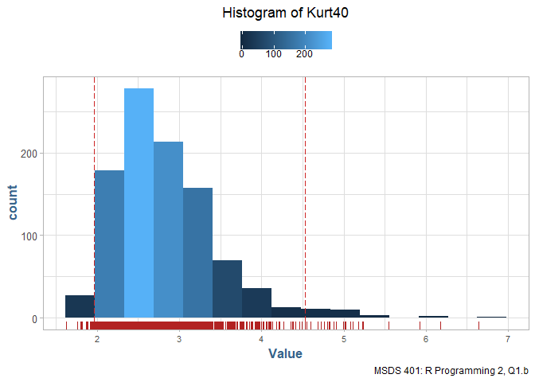<!-- -->

```r
# SKurt160
kurt160 <- getKurtosis(sample160)
kurt160.sd <- sd(skew160$Value)
kurt160.tsd <- theoretical_kt(160)
getValueHist(kurt160, "Kurt160", q1b_cap)
```

<!-- -->

```r
results <- data.table(Size = c(10, 40, 160),
	   StdDev = c(kurt10.sd, kurt40.sd, kurt160.tsd),
	   Theoretical = c(kurt10.tsd, kurt40.tsd, kurt160.tsd))

pretty_kable(results, "Standard Deviations of Kurtosis")
```

<table class="table table-striped table-hover" style="margin-left: auto; margin-right: auto;">
<caption>Standard Deviations of Kurtosis</caption>
 <thead>
  <tr>
   <th style="text-align:right;"> Size </th>
   <th style="text-align:right;"> StdDev </th>
   <th style="text-align:right;"> Theoretical </th>
  </tr>
 </thead>
<tbody>
  <tr>
   <td style="text-align:right;"> 10 </td>
   <td style="text-align:right;"> 0.73 </td>
   <td style="text-align:right;"> 0.75 </td>
  </tr>
  <tr>
   <td style="text-align:right;"> 40 </td>
   <td style="text-align:right;"> 0.64 </td>
   <td style="text-align:right;"> 0.64 </td>
  </tr>
  <tr>
   <td style="text-align:right;"> 160 </td>
   <td style="text-align:right;"> 0.37 </td>
   <td style="text-align:right;"> 0.37 </td>
  </tr>
</tbody>
</table>

### c.) Observations
__(2 points)__

_Evaluate the results you have obtained._

What do you observe regarding the convergence of the sampling distributions in terms of their shapes as a function of sample size, and accuracy in comparison to the 
"true"" skewness value of 0.0 and kurtosis value of 3.0.

__Answer:__

As the sample size increases, we see the Centeral Limit Therom take hold and the skewness / kurtosis of the distributions converge closer to the 
values of the normal distribution, 0 and 3 respectively.

-----

## 2.) Quartiles 

This problem requires quartile calculations using random samples of different sizes from the standard normal distribution. The quartiles for the standard normal distribution 
are (-0.6745, 0.0 and +0.6745), obtainable by *qnorm(c(0.25, 0.5, 0.75), mean = 0, sd = 1, lower.tail = TRUE)*.  This is illustrated below.


```r
qnorm(c(0.25, 0.5, 0.75), mean = 0, sd = 1, lower.tail = TRUE)
```

```
## [1] -0.6744898  0.0000000  0.6744898
```

### a.) Variations
__(4 points)__

+ Use *set.seed(127)* and *rnorm(n, mean = 0, sd = 1)* with *n* = 25, *n* = 50, *n* = 100 and draw three random samples. 
+ Reset *set.seed(127)* prior to drawing each of the three samples.
+ For each sample, calculate the first, second and third quartile using *quantile()* specifying "type = 2" (Business Statistics) and "type = 7" (R default). 
+ Generate the quartiles use each method. 

Display the results in a table for comparison purposes. 

_Take note of the results for the first and third quartile in particular._


```r
# Add your set.seed(), rnorm() and quantile() code to this code 'chunk'.
# Use set.seed(127) prior to drawing a random sample each time.

as.numeric.factor <- function(x) { as.numeric(levels(x))[x] }

get_sample <- function(n, reseed = T) {

	if (reseed == T) set.seed(127)

	rnorm(n, 0, 1)
}

S_25 <- get_sample(25)
S_50 <- get_sample(50)
S_100 <- get_sample(100)

convert_to_numeric <- function(tbl) {
	tbl[, 3] <- as.numeric.factor(tbl[, 3])
	tbl[, 4] <- as.numeric.factor(tbl[, 4])
	tbl[, 5] <- as.numeric.factor(tbl[, 5])
	tbl[, 6] <- as.numeric.factor(tbl[, 6])
	tbl[, 7] <- as.numeric.factor(tbl[, 7])

    tbl
}

get_quantiles <- function(x) {
	m1 <- as.data.frame(t(c(size = length(x), type = "BS", quantile(x, type = 2))))
	m1 <- convert_to_numeric(m1)

    m2 <- as.data.frame(t(c(size = length(x), type = "R", quantile(x, type = 7))))
	m2 <- convert_to_numeric(m2)

    as.data.table( rbind(m1, m2) )
}

q2.a <- rbind(get_quantiles(S_25), get_quantiles(S_50), get_quantiles(S_100))

pretty_kable(q2.a, "Sample Quantiles", 5)
```

<table class="table table-striped table-hover" style="margin-left: auto; margin-right: auto;">
<caption>Sample Quantiles</caption>
 <thead>
  <tr>
   <th style="text-align:left;"> size </th>
   <th style="text-align:left;"> type </th>
   <th style="text-align:right;"> 0% </th>
   <th style="text-align:right;"> 25% </th>
   <th style="text-align:right;"> 50% </th>
   <th style="text-align:right;"> 75% </th>
   <th style="text-align:right;"> 100% </th>
  </tr>
 </thead>
<tbody>
  <tr>
   <td style="text-align:left;"> 25 </td>
   <td style="text-align:left;"> BS </td>
   <td style="text-align:right;"> -1.73947 </td>
   <td style="text-align:right;"> -0.49394 </td>
   <td style="text-align:right;"> -0.02981 </td>
   <td style="text-align:right;"> 0.60593 </td>
   <td style="text-align:right;"> 1.33169 </td>
  </tr>
  <tr>
   <td style="text-align:left;"> 25 </td>
   <td style="text-align:left;"> R </td>
   <td style="text-align:right;"> -1.73947 </td>
   <td style="text-align:right;"> -0.49394 </td>
   <td style="text-align:right;"> -0.02981 </td>
   <td style="text-align:right;"> 0.60593 </td>
   <td style="text-align:right;"> 1.33169 </td>
  </tr>
  <tr>
   <td style="text-align:left;"> 50 </td>
   <td style="text-align:left;"> BS </td>
   <td style="text-align:right;"> -1.98422 </td>
   <td style="text-align:right;"> -0.74936 </td>
   <td style="text-align:right;"> -0.13061 </td>
   <td style="text-align:right;"> 0.56462 </td>
   <td style="text-align:right;"> 1.76871 </td>
  </tr>
  <tr>
   <td style="text-align:left;"> 50 </td>
   <td style="text-align:left;"> R </td>
   <td style="text-align:right;"> -1.98422 </td>
   <td style="text-align:right;"> -0.74763 </td>
   <td style="text-align:right;"> -0.13061 </td>
   <td style="text-align:right;"> 0.53368 </td>
   <td style="text-align:right;"> 1.76871 </td>
  </tr>
  <tr>
   <td style="text-align:left;"> 100 </td>
   <td style="text-align:left;"> BS </td>
   <td style="text-align:right;"> -1.98422 </td>
   <td style="text-align:right;"> -0.67149 </td>
   <td style="text-align:right;"> 0.00247 </td>
   <td style="text-align:right;"> 0.72569 </td>
   <td style="text-align:right;"> 2.87373 </td>
  </tr>
  <tr>
   <td style="text-align:left;"> 100 </td>
   <td style="text-align:left;"> R </td>
   <td style="text-align:right;"> -1.98422 </td>
   <td style="text-align:right;"> -0.64796 </td>
   <td style="text-align:right;"> 0.00247 </td>
   <td style="text-align:right;"> 0.71264 </td>
   <td style="text-align:right;"> 2.87373 </td>
  </tr>
</tbody>
</table>

The central limit theorem can be used to derive a quantile estimate standard deviation formula.  It estimates the standard deviation of the sampling distribution of any given sample quantile. This formula is valid for a known continuous density function.  It is a function of that density function, quantile probabilities and sample size. 

In the limit, as the sample size increases, a quantile estimate will have a normal sampling distribution with an expected value equal to the true value q and a variance equal to ```p(1 - p) / n(f(q)**2)```.  In this statement, f() denotes the formula for the density function, and p is the probability (percentile) corresponding to the quantile.  For example, in the case of a standard normal density, for the median, q = 0 and f(q) = *dnorm(0, 0, 1)* and p = *pnorm(q, 0, 1, lowertail = TRUE)*.

For a selected coverage level, such formulas may be used to superimpose boundary curves on the plots produced in Part 1.  Execute the code below which illustrates this for the estimate of the median.  Since the central limit theorem promises convergence to normality, these curves are constructed to contain 95% of the median estimates for each sample size. Similar curves may be constructed for quartile estimates. 


```r
set.seed(127)
quant <- numeric(0)
for (k in seq(from = 25, to = 5000, by = 25)){
  x <- rnorm(k, mean = 0, sd = 1)
  quant <- rbind(quant, quantile(x, probs = 0.5, type = 7))
}

size <- seq(from = 25, to = 5000, by = 25)

c1 <- qnorm(0.975,0,1,lower.tail = T)
c2 <- qnorm(0.025, 0, 1, lower.tail = T)

plot(size, quant, main = "Median Estimates versus Sample Size", xlab = "Sample Size", ylab = "Median", ylim = c(-0.2,0.2))
abline(h = 0.0)
lines(size, c1*sqrt(0.5*0.5/(size*dnorm(0,0,1)**2)), col = "red")
lines(size, c2*sqrt(0.5*0.5/(size*dnorm(0,0,1)**2)), col = "red")
```

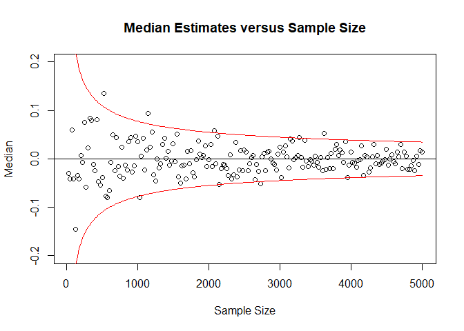<!-- -->

### b.)
__(3 points)__


```r
# utility function for scatter in a and b.
getValueScatter <- function(data, desc, cap, ylimit, true_value) {

	ggplot(data, aes(x = Size, y = Value)) +
		geom_point(aes(color = size)) +
		scale_color_gradient(low = "firebrick", high = "steelblue") +
		coord_cartesian(ylim = ylimit) +
		geom_hline(yintercept = true_value, linetype = 11, color = "darkgreen", lwd = .8) +
		labs(title = desc, caption = cap) +
	    theme(legend.text = element_blank())
}
```

Using code based on the example above, generate scatterplots showing the sample quartile values for the first and third quartiles calculated using type = 7 for the sample sizes in *seq(from = 25, to = 5000, by = 25)*. Do not add the curved boundary lines. For these plots use *ylim = c(-0.4, -0.9)* for the first quartile, and *ylim = c(0.4, 0.9)* for the third quartile. Give consideration to color, titles and legends.


```r
# Add your set.seed(), rnorm() and quantile() code to this code 'chunk'.
# Only use set.seed(127) once at the beginning of your code 'chunk'.

set.seed(127)

size <- seq(from = 25, to = 5000, by = 25)

getQuartileValues <- function(prob) { 
    quant <- numeric(0)
    for (k in seq(from = 25, to = 5000, by = 25)) {
	    x <- rnorm(k, mean = 0, sd = 1)
	    quant <- rbind(quant, quantile(x, probs = prob, type = 7))
	}
	quant[, 1]
}

# 1st Quartile

getValueScatter(data.table(Size = size, Value = getQuartileValues(.25)),
    "1st Quantile Estimate versus Sample Size", 
	"MSDS 401: R Programming 2, Q2.a",
	c(-0.4, -0.9),
    qnorm(.25))
```

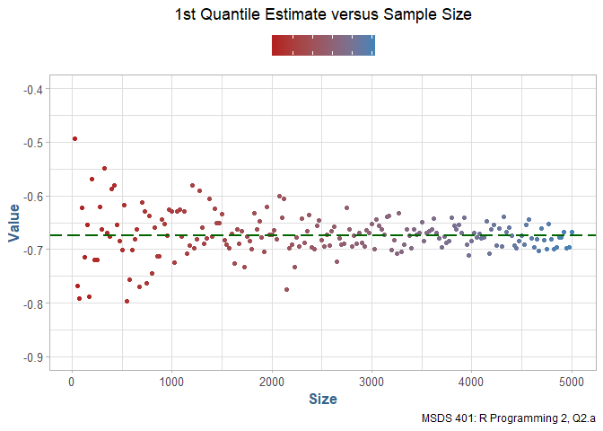<!-- -->

```r
# 3rd Quartile

getValueScatter(data.table(Size = size, Value = getQuartileValues(.75)),
	"3rd Quantile Estimate versus Sample Size",
	"MSDS 401: R Programming 2, Q2.b",
	c(0.4, 0.9),
    qnorm(.75))
```

<!-- -->

### c.)
__(3 points)__

Comment. What do these displays indicate about convergence of quartile estimates to the true values?  Make at least two observations.

__Answer:__

The plots show a clear convergence to the true value with increasing sample sizes. Although, even at 5000 sample size, which is relativly large, we see that there is
still a conciderable amount of error compared to the true values denoted by the dark green line. All 3 plots exhibit a conic 

-----

## 3.) Confidence Intervals

Bootstrapping will be used to estimate confidence intervals for the variance of a non-normal distribution. Earthquake magnitude data will be used. 
Results will be compared to confidence intervals constructed using the traditional chi-square method that assumes normality. The earthquake magnitude data are 
right-skewed and are not derived from a normal distribution.

The following code 'chunk' defines the vector "mag" with the earthquake magnitudes, and illustrates evidence of non-normality.


```r
mag <- c(0.70, 0.74, 0.64, 0.39, 0.70, 2.20, 1.98, 0.64, 1.22, 0.20, 1.64, 1.02, 
         2.95, 0.90, 1.76, 1.00, 1.05, 0.10, 3.45, 1.56, 1.62, 1.83, 0.99, 1.56,
         0.40, 1.28, 0.83, 1.24, 0.54, 1.44, 0.92, 1.00, 0.79, 0.79, 1.54, 1.00,
         2.24, 2.50, 1.79, 1.25, 1.49, 0.84, 1.42, 1.00, 1.25, 1.42, 1.15, 0.93,
         0.40, 1.39)

par(mfrow = c(1,2))
hist(mag)
boxplot(mag)
```

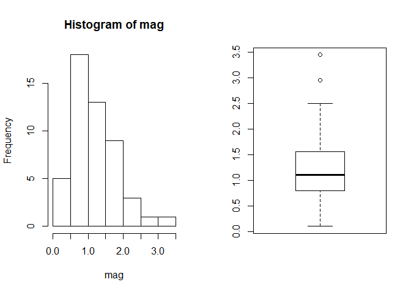<!-- -->

```r
par(mfrow = c(1,1))

qqnorm(mag)
qqline(mag)
```

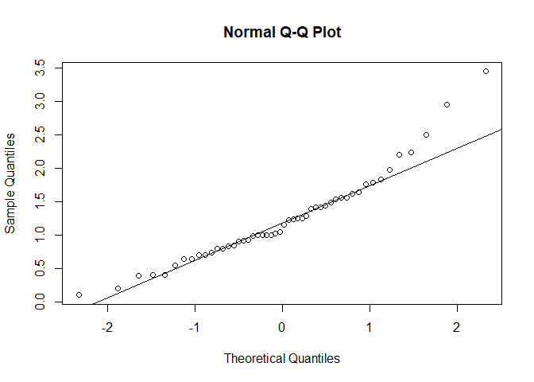<!-- -->

### a.) Chi-Squared
__(2 points)__

Compute the confidence interval for the population variance using the traditional chi-square method which assumes normality.The sample variance point estimate may be 
calculated using the *var()* function. You will need to add code calculating a 95% confidence interval for the sample variance estimate, based on a chi-square distribution. 

_This assumes normality._


```r
n <- length(mag)
conf.level = 0.95

df <- n - 1
chilower <- qchisq((1 - conf.level) / 2, df, lower.tail = TRUE)
chiupper <- qchisq((1 - conf.level) / 2, df, lower.tail = FALSE)
v <- var(mag)
conf.int <- c(df * v / chiupper, df * v / chilower)
pretty_vector(round(conf.int, 2))
```

_0.31_ and _0.68_

There is an extensive literature on bootstrapping. The methods shown here give an indication of the possibilities for estimating confidence intervals for a wide range of parameters. 
Some literature citations will be mentioned. 

### b.) Bootstrap
__(5 points)__

Use the Percentile Bootstrap Method for estimating a 95% confidence interval for the variance. This requires drawing 10000 random samples of size *n* = 50 with replacement from the earthquake 
data "mag". The sample variance will be computed for each, and the 2.5% (0.025) and 97.5% (0.975) quantiles computed for these data using *quantile()*. Please keep *set.seed(123)*. 
The *replicate()* function can be used to easily "replicate" the sampling and sample variance steps, with *n* = 10000. Quantiles are then determined from the distribution of results.

Present a histogram of the 10,000 sample variances along with the confidence interval. Show the quantiles on a histogram of the 10,000 sample variances. The quantiles provide a 95% 
percentile bootstrap confidence interval. 

Present a table displaying the chi-square confidence interval and the bootstrap confidence interval.


```r
set.seed(123)

n <- 50

raw.bootstrap <- as.data.table(replicate(10000, sample(mag, n, replace = T), simplify = "array"))
bootstrap.variance <- raw.bootstrap[, .(Value = sapply(.SD, var))]
bootstrap.quantiles <- round(quantile(bootstrap.variance$Value, c(0.025, 0.975)), 3)

q3a_cap <- "MSDS 401: R Programming 2, Q3.b"

# Bootstrap Hist
getValueHist(bootstrap.variance, paste("Bootstrap Variance"), q3a_cap)
```

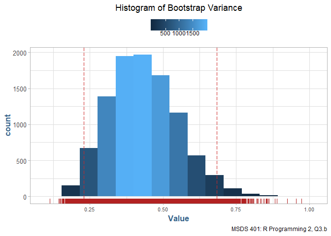<!-- -->

```r
pretty_kable( rbind(c(Method = "Chi-Squared",round(conf.int, 3)),c( Method = "Bootstrap", bootstrap.quantiles)), "Confidence Interval Comparison" )
```

<table class="table table-striped table-hover" style="margin-left: auto; margin-right: auto;">
<caption>Confidence Interval Comparison</caption>
 <thead>
  <tr>
   <th style="text-align:left;"> Method </th>
   <th style="text-align:left;">  </th>
   <th style="text-align:left;">  </th>
  </tr>
 </thead>
<tbody>
  <tr>
   <td style="text-align:left;"> Chi-Squared </td>
   <td style="text-align:left;"> 0.307 </td>
   <td style="text-align:left;"> 0.683 </td>
  </tr>
  <tr>
   <td style="text-align:left;"> Bootstrap </td>
   <td style="text-align:left;"> 0.23 </td>
   <td style="text-align:left;"> 0.684 </td>
  </tr>
</tbody>
</table>

### c.) Analysis
__(2 points)__

Compare and comment upon the traditional (i.e. chi-square) and bootstrap confidence interval results. Which would you use? Why?

__Answer:__

In this case, I would use the bootstrap method simply because the mag distribution isn't normal, and Chi-Sqared assumes normality. It doesn't appear likely that
the true distribution of mag is normal, and I believe the bootstrap method to be more applicable in this scenario.

This next part requires using the "boot" package discussed in Kabacoff Section 12.6, pages 292-298. The "boot" package requires a function be written to return the sample variance 
values for each individual resample drawn. Use the following function in *boot()* for the argument "statistic." This function is defined for you below.


```r
f <- function(data, i){
  d <- data[i]
  return(var(d))
}
```

### d.) boot pkg
__(6 points)__

The user-defined function is passed to *boot()* with "mag" along with the number of samples to be drawn with replacement; here, 10000. The resulting object will be a list. 
The element "t" of this list is the vector of sample variances. This vector may be used to estimate the relevant quantiles for our interval.

Again, please keep *set.seed(123)*.


```r
library(boot)  # install.packages("boot")
set.seed(123)

# Here, you will need to add code defining an object created by boot() with data = mag, statistic = f,
# and R = 10000. For calculating the quantiles, you will need to refer to the vector of results via "$t".

results <- boot(mag, statistic = f, R = 10000)
```

The "boot" package has a variety of options for determining confidence intervals. See *boot.ci()*, shown below, with the percentile option. The different computational options may produce 
slightly different results depending on the number of samples drawn during bootstrapping.

For example, we could use *boot.ci()*. To do this, we need to pass the object defined above by *boot()*, specifying "conf = 0.95" and "type = "perc". *boot.ci()* calculates confidence 
intervals and stores them at "$percent" of the output. Present the output of the described *boot.ci()* call.


```r
# Add your code here.

pretty_vector( boot.ci(results, conf = 0.95, type = "perc")$percent )
```


------------------------------------------
 conf   &nbsp;   &nbsp;   &nbsp;   &nbsp; 
------ -------- -------- -------- --------
 0.95    250      9751    0.2276   0.6892 
------------------------------------------

-----

## 4.) Boot Package

Fisher proposed a method for calculating a confidence interval for the Pearson Correlation Coefficient. This method involves transformation of r, the sample Pearson Correlation Coefficient. 
A z-score is calculated and confidence interval is constructed. This confidence interval is then transformed back to the original scale of measurement. This method is explained in the links:

http://www2.sas.com/proceedings/sugi31/170-31.pdf

http://onlinestatbook.com/2/estimation/correlation_ci.html

Use the data provided and construct the data frame "test" with the code below.  The data frame contains test results for 49 students on two standardized tests. Each student took both tests. 

__Do not change the order of the two test entries or the matching per student will not be correct__


```r
testA <- c(58,49.7,51.4,51.8,57.5,52.4,47.8,45.7,51.7,46,50.4,61.9,49.6,61.6,54,54.9,49.7,
           47.9,59.8,52.3,48.4,49.1,53.7,48.4,47.6,50.8,58.2,59.8,42.7,47.8,51.4,50.9,49.4,
           64.1,51.7,48.7,48.3,46.1,47.3,57.7,41.8,51.5,46.9,42,50.5,46.3,44,59.3,52.8)
testB <- c(56.1,51.5,52.8,52.5,57.4,53.86,48.5,49.8,53.9,49.3,51.8,60,51.4,60.2,53.8,52,
           49,49.7,59.9,51.2,51.6,49.3,53.8,50.7,50.8,49.8,59,56.6,47.7,47.2,50.9,53.3,
           50.6,60.1,50.6,50,48.5,47.8,47.8,55.1,44.9,51.9,50.3,44.3,52,49,46.2,59,52)

test <- as.data.frame(cbind(testA,testB))

str(test)
```

```
## 'data.frame':	49 obs. of  2 variables:
##  $ testA: num  58 49.7 51.4 51.8 57.5 52.4 47.8 45.7 51.7 46 ...
##  $ testB: num  56.1 51.5 52.8 52.5 57.4 ...
```

```r
summary(test)
```

```
##      testA           testB      
##  Min.   :41.80   Min.   :44.30  
##  1st Qu.:47.80   1st Qu.:49.30  
##  Median :50.50   Median :51.40  
##  Mean   :51.25   Mean   :51.95  
##  3rd Qu.:53.70   3rd Qu.:53.80  
##  Max.   :64.10   Max.   :60.20
```

```r
plot(test$testA,test$testB)
```

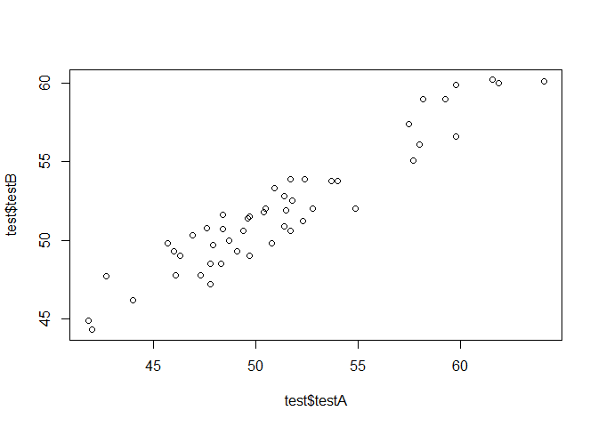<!-- -->

### a.) Fisher's Z
__(3 points)__

Determine a 95% confidence interval for the Pearson Correlation Coefficient of the data in "test" using Fisher's method. Present the code and the confidence interval for rho, 
the Pearson Correlation Coefficient. Calculations can be simplified using *tanh()* and *atanh()*. Also, submit the data to *cor.test()* and present those results as well.


```r
len_a <- length(test$testA)
len_b <- length(test$testB)

stopifnot(len_a == len_b)

N <- len_a

correlation <- cor(test$testA, test$testB)

sigmaz <- 1 / sqrt(N - 3)
normz <- qnorm(1 - (1 - .95) / 2)

fisherz <- 0.5 * ( log(1 + correlation) - log(1 - correlation))
lower_ci <- fisherz - (normz * sigmaz)
upper_ci <- fisherz + (normz * sigmaz)

ci_lower <- (exp(2 * lower_ci) - 1) / (exp(2 * lower_ci) + 1)
ci_upper <- (exp(2 * upper_ci) - 1) / (exp(2 * upper_ci) + 1)

pretty_vector(c(Lower = ci_lower, Cor = correlation, Upper = ci_upper), label = "95% confidence interval")
```


--------------------------
 Lower     Cor     Upper  
-------- -------- --------
 0.9113   0.9492   0.9712 
--------------------------

```r
cor.test(test$testA, test$testB, method = "p")
```

```
## 
## 	Pearson's product-moment correlation
## 
## data:  test$testA and test$testB
## t = 20.69, df = 47, p-value < 2.2e-16
## alternative hypothesis: true correlation is not equal to 0
## 95 percent confidence interval:
##  0.9113003 0.9712052
## sample estimates:
##       cor 
## 0.9492478
```

### b.) Correlation Bootstrap
__(5 points)__

Bootstrapping can be used to arrive at an estimated confidence interval. The process involves resampling with replacement of rows from "test."

+ The first step is to randomly sample with replacement the 49 rows of "test".
+ Each sample will consist of 49 rows for which a sample correlation coefficient is calculated. For this purpose, the function *sample.int()* may be used to determine a sample of row numbers to be used. 
+ The function *cor()* should be used to determine the sample correlation coefficient. 
+ This step is repeated 10,000 times resulting in 10,000 sample correlation coefficients. 
+ The 10,000 calculated sample correlation coefficients are written to a vector. 
+ *quantile()* is passed this vector to calculate the 2.5% (0.025) and 97.5% (0.975) quantiles which determines the 95% Percentile Bootstrap confidence interval.

Refer to the course site library reserves and read the listing for Section 9.5 of "Mathematical Statistics with Resampling and R," by Chihara and Hesterberg.

You will write code which does this work. Use *set.seed(123)*. A "for" loop may be used to repeat the sampling and correlation coefficient calculations. Plot a histogram and report a 
two-sided 95% confidence interval. 


```r
set.seed(123)

sample_cor <- function() { 
    test.sample <- test[ sample.int(49, size = 49, replace = T), ]
    test.sample.cor <- cor(test.sample$testA, test.sample$testB)
}

test.cor.bootstrap <- as.data.table(replicate(10000, sample_cor(), simplify = "array"))[, .(Value = V1)]

getValueHist(test.cor.bootstrap, "Test Correlation", "MSDS 401 Q4.b") +
    theme(legend.text = element_blank())
```

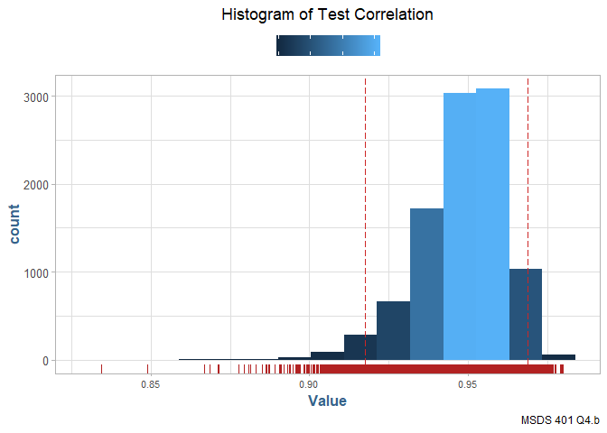<!-- -->

```r
pretty_vector(c(quantile(test.cor.bootstrap$Value, 0.025), quantile(test.cor.bootstrap$Value, 0.975)))
```


-----------------
  2.5%    97.5%  
-------- --------
 0.9176   0.9688 
-----------------

### c.) Regression
__(5 points)__

Bootstrapping can also be used to arrive at confidence intervals for regression coefficients. This process is similar to the process in __4(b)__. Using the current data frame, rows of "test" are 
randomly sampled with replacement. Each sample is passed to *lm()* and the coefficients extracted. Section 9.5 of Chihara and Hesterberg give an example R script showing how this may be accomplished.

Write code using "test" to produce histograms and 95% two-sided bootstrap confidence intervals for the intercept and slope of a simple linear regression. Please keep *set.seed(123)*. A "for" loop can 
be written to sample via *sample.int()*, a linear regression model fit via *lm()* and the coefficients extracted via *coef()*. Note that we pass our fitted model object to *coef()* to return 
the coefficients. You can use brackets after *coef()* to specify particular elements in the output. For example, *coef(model)[1]* - assuming our fitted linear model was "model" - would return the 
1st element in the *coef()* output.

Present two histograms, one for the bootstrapped intercept results, and one for the bootstrapped slope results showing the 2.5% and 97.5% quantiles on each.  In addition, show the 
location on the histograms of the estimated intercept and slope of test using *lm()* without bootstrapping.

Lastly, generate a scatter plot of the estimated bootstrap slopes versus the estimated bootstrap intercepts.  There will be 10,000 points appearing in this plot, one for each bootstrap sample.  

_Place the intercepts on the x-axis and the slopes on the y-axis._


```r
set.seed(123)

sample_lm <- function() {
    test.sample <- test[sample.int(49, size = 49, replace = T),]
	model.coef <- lm(test.sample$testA ~ test.sample$testB)$coefficients
	data.table( Intercept = model.coef[[1]], Slope = model.coef[[2]])
}

test.lm.bootstrap <- data.table()

for (i in 1:10000) {
	test.lm.bootstrap <- rbind(test.lm.bootstrap, sample_lm())
}

simple.lm <- lm(test$testA ~ test$testB)

lm.intercept <- coef(simple.lm)[1]

getValueHist(test.lm.bootstrap[, .(Value = Intercept)], paste("Intercept (Non-bootstrapped Value:", round(lm.intercept,3), ")"), "MSDS 401 Q4.c") +
	geom_vline(xintercept = lm.intercept, lwd = 1.2, color = "darkgreen", linetype = 12) +
    theme(legend.text = element_blank())
```

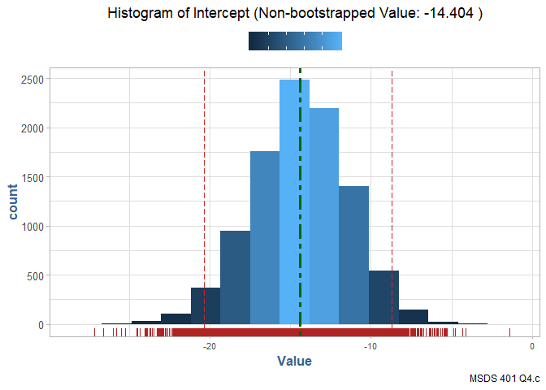<!-- -->

```r
lm.slope <- coef(simple.lm)[2]

getValueHist(test.lm.bootstrap[, .(Value = Slope)], paste("Slope, (Non-bootstrapped Value:", round(lm.slope, 3), ")"), "MSDS 401 Q4.c") +
	geom_vline(xintercept = lm.slope, lwd = 1.2, color = "darkgreen", linetype = 12) +
	theme(legend.text = element_blank())
```

<!-- -->

```r
ggplot(test.lm.bootstrap, aes(x = Intercept, y = Slope)) +
	geom_jitter(aes(color = Intercept)) +
	geom_smooth(method = "lm", color = "firebrick") +
	labs(title = "Scatter of Bootstrapped Intercept vs Slope", caption = "MSDS 401 Q4.c") +
	theme(legend.text = element_blank())
```

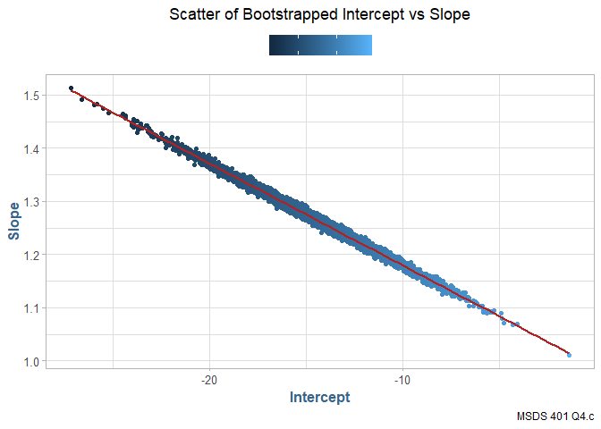<!-- -->

### d.) Analysis
__(2 points)__

What does the plot of the estimated bootstrap slopes versus the estimated bootstrap intercepts plot indicate about these estimates?  

__Answer:__

The scatter plot shows a strong negative linear correlation between the estimated slope and estimated intercept. The histograms also have a relatively
identical approximately normal distributions, so the shape of this plot isn't unexpected. 

##### The "boot" package provides a considerable capability for bootstrapping. Other discussions are given at:  http://www.ats.ucla.edu/stat/r/faq/boot.htm and http://www.statmethods.net/advstats/bootstrapping.html.
