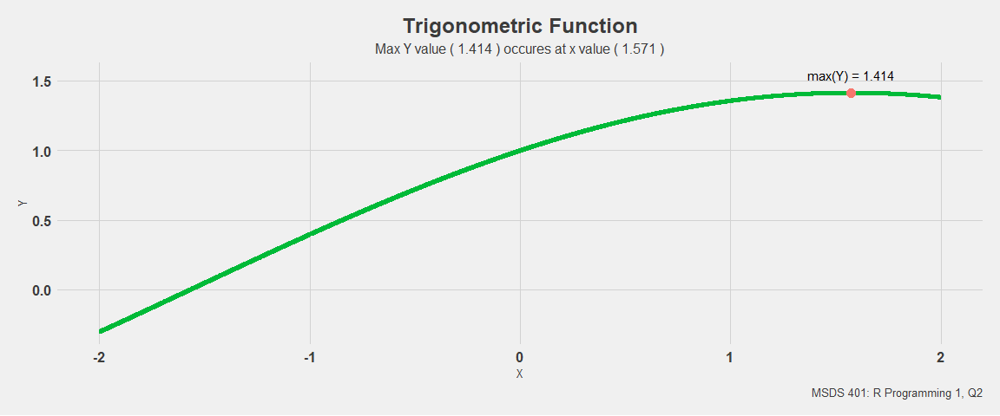
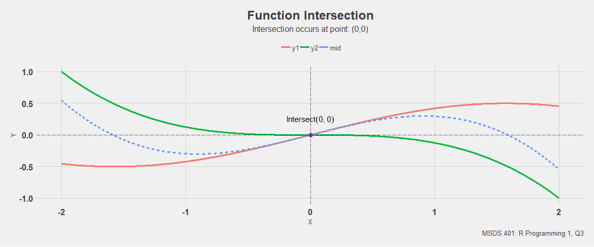
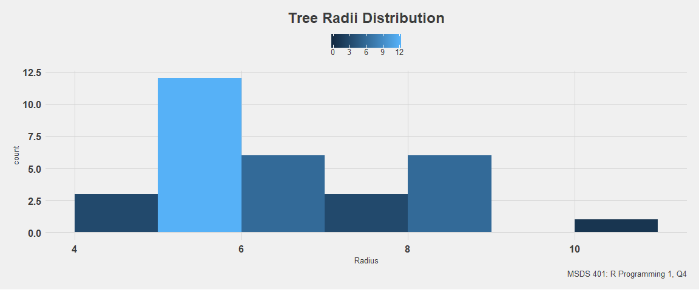
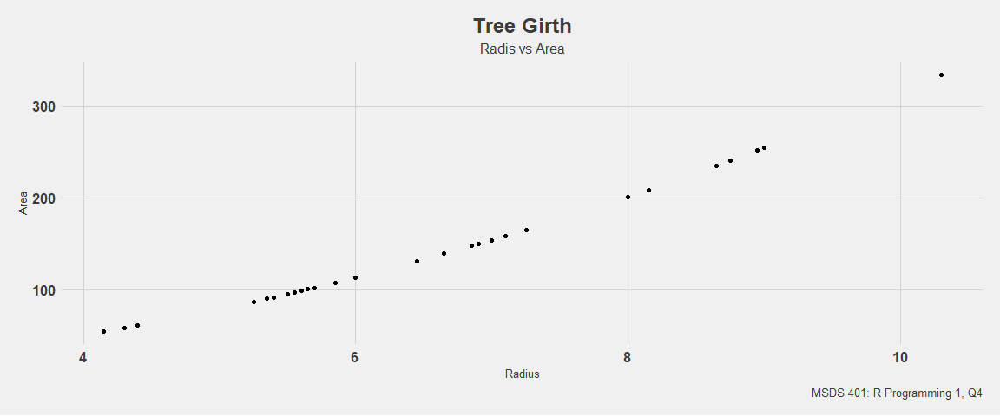
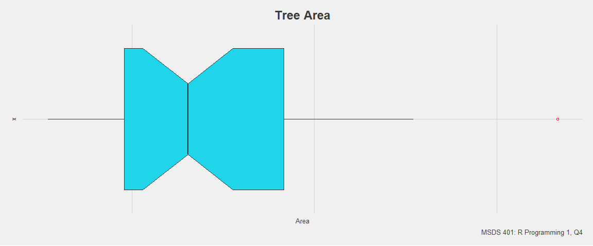
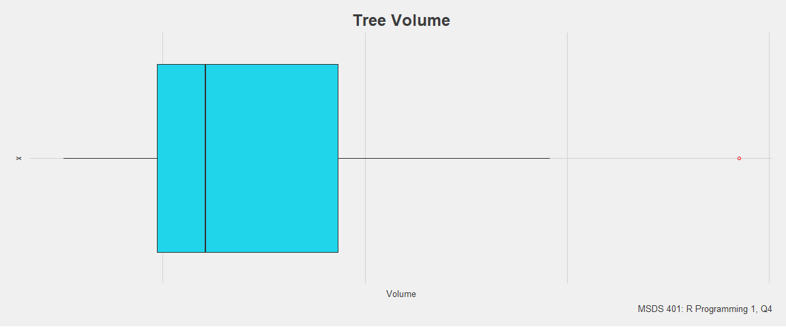
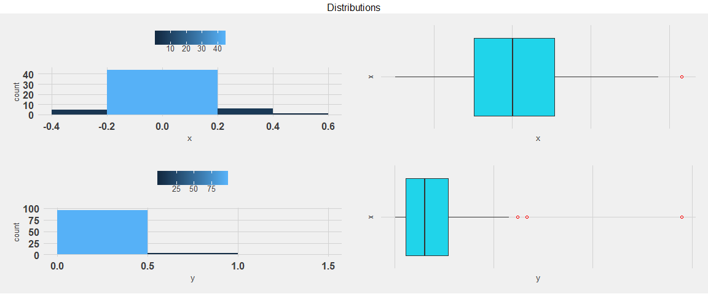
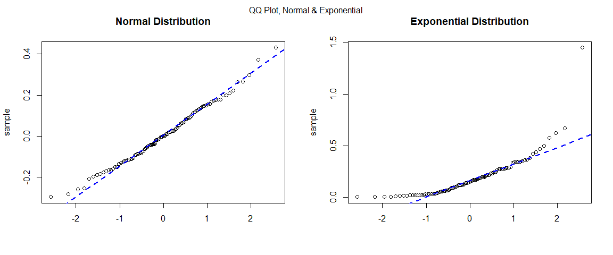
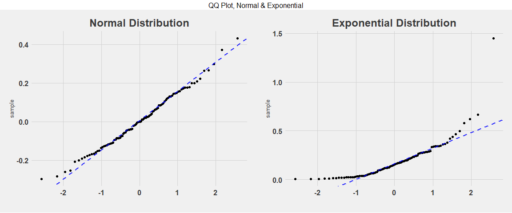

### Test Items

Read each question carefully and address each element.  Do not output contents of vectors or data frames unless requested.

## 1.) Vector Manipulations

(4 points) This problem deals with vector manipulations.

### a.) Concatenation

Create a vector that contains the following, in this order, and __output the final, resulting vector__.

__Do not round any values, unless requested.__

+ A sequence of integers from 0 to 4, inclusive.
+ The number 13
+ Three repetitions of the vector c(2, -5.1, -23).
+ The arithmetic sum of 7/42, 3 and 35/42

_0_, _1_, _2_, _3_, _4_, _13_, _2_, _-5.1_, _-23_, _2_, _-5.1_, _-23_, _2_, _-5.1_, _-23_ and _4_

### b.) Sorting

+ Sort the vector created in __(1)(a)__ in ascending order.  __Output this result__.  
+ Determine the length of the resulting vector and assign to "L". __Output L__. 
+ Generate a descending sequence starting with L and ending with 1.  
+ Add this descending sequence arithmetically the sorted vector. This is __vector addition__, _not vector combination_. __Output the contents__. 

_Do not round any values._

_-23_, _-23_, _-23_, _-5.1_, _-5.1_, _-5.1_, _0_, _1_, _2_, _2_, _2_, _2_, _3_, _4_, _4_ and _13__16__-7_, _-8_, _-9_, _7.9_, _6.9_, _5.9_, _10_, _10_, _10_, _9_, _8_, _7_, _7_, _7_, _6_ and _14_

### c.) Subsetting

+ Extract the first and last elements of the vector you have created in __(1)(b)__ to form another vector with the extracted elements. 
+ Form a third vector from the elements not extracted. 
+ __Output these vectors__.

_-7_ and _14__-8_, _-9_, _7.9_, _6.9_, _5.9_, _10_, _10_, _10_, _9_, _8_, _7_, _7_, _7_ and _6_

### d.) Reconstruction

+ Use the vectors from __(c)__ to reconstruct the vector in __(b)__.
+ __Output this vector__. 
+ Sum the elements and round to two decimal places.

_-7_, _-8_, _-9_, _7.9_, _6.9_, _5.9_, _10_, _10_, _10_, _9_, _8_, _7_, _7_, _7_, _6_ and _14__84.7_

-----

## 2.) Trigonometric Function

(5 points) The expression y = sin(x/2) + cos(x/2) is a trigonometric function.

### a.) User-Defined Function

Create a user-defined function - via *function()* - that implements the trigonometric function above, accepts numeric values, "x," 
calculates and returns values "y."


### b.) Logical Subset

+ Create a vector, x, of 4001 equally-spaced values from -2 to 2, inclusive. 

+ Compute values for y using the vector x and your function from __(2)(a)__.  **Do not output x or y.**

+ Find the value in the vector x that corresponds to the __maximum__ value in the vector y. 
Restrict attention to only the values of x and y you have computed; i.e. do not interpolate. 
Round to 3 decimal places and output both the minimum y and corresponding x value.

+ Finding the two desired values can be accomplished in as few as two lines of code.  

__Do not use packages or programs you may find on the internet or elsewhere.__

__Do not output the other elements of the vectors x and y.__

Use coding methods shown in the *Quick Start Guide for R*.

_1.571_ and _1.414_

### c.) Visualization

+ Plot y versus x in color, with x on the horizontal axis. 
+ Show the location of the __maximum__ value of y determined in __2(b)__.  
+ Show the values of x and y corresponding to the __maximum__ value of y in the display.
+ Add a title and other features such as text annotations. 

_Text annotations may be added via *text()* for base R plots and *geom_text()* or *geom_label()* for ggplots._

<!-- -->

-----

## 3.) Function Intersection

_(4 points)_ This problem requires finding the point of intersection of two functions. 
Using the function `y = cos(x/2)*sin(x/2)`, 

+ find where the curved line `y = -(x/2)**3` intersects it within the range of values used in part (2) 
_(i.e. 4001 equally-spaced values from -2 to 2)_.  
+ Plot both functions on the same display, and show the point of intersection. 
+ Present the coordinates of this point as text in the display.

NOTE:  the functions to implement are enclosed in backticks. Ignore the backticks when implementing in code.


+ Plot both functions on the same display, and show the point of intersection.  
+ Present the coordinates of this point as text in the display.

<!-- -->

-----

## 4.) Trees

(6 points) Use the "trees" dataset for the following items.

_This dataset has three variables (Girth, Height, Volume) on 31 felled black cherry trees._

### a.) Dataset

+ Use *data(trees)* to load the dataset. 
+ Check and output the structure with *str()*. 
+ Use *apply()* to return the median values for the three variables. __Output these values__.  
+ Using R and logicals, output the row number and the three measurements - Girth, Height and Volume - of any trees with Girth equal to median Girth. 

_It is possible to accomplish this last request with one line of code._ 


```
## Classes 'data.table' and 'data.frame':	31 obs. of  3 variables:
##  $ Girth : num  8.3 8.6 8.8 10.5 10.7 10.8 11 11 11.1 11.2 ...
##  $ Height: num  70 65 63 72 81 83 66 75 80 75 ...
##  $ Volume: num  10.3 10.3 10.2 16.4 18.8 19.7 15.6 18.2 22.6 19.9 ...
##  - attr(*, ".internal.selfref")=<externalptr>
```

<div data-pagedtable="false">
  <script data-pagedtable-source type="application/json">
{"columns":[{"label":["Girth"],"name":[1],"type":["dbl"],"align":["right"]},{"label":["Height"],"name":[2],"type":["dbl"],"align":["right"]},{"label":["Volume"],"name":[3],"type":["dbl"],"align":["right"]}],"data":[{"1":"12.9","2":"76","3":"24.2"}],"options":{"columns":{"min":{},"max":[10]},"rows":{"min":[10],"max":[10]},"pages":{}}}
  </script>
</div><div data-pagedtable="false">
  <script data-pagedtable-source type="application/json">
{"columns":[{"label":["Row"],"name":[1],"type":["int"],"align":["right"]},{"label":["Girth"],"name":[2],"type":["dbl"],"align":["right"]},{"label":["Height"],"name":[3],"type":["dbl"],"align":["right"]},{"label":["Volume"],"name":[4],"type":["dbl"],"align":["right"]}],"data":[{"1":"16","2":"12.9","3":"74","4":"22.2"},{"1":"17","2":"12.9","3":"85","4":"33.8"}],"options":{"columns":{"min":{},"max":[10]},"rows":{"min":[10],"max":[10]},"pages":{}}}
  </script>
</div>

### b.) Calculation

Girth is defined as the diameter of a tree taken at 4 feet 6 inches from the ground. 

+ Convert each diameter to a radius, r. 
+ Calculate the cross-sectional area of each tree using pi times the squared radius. 
+ Present a stem-and-leaf plot of the radii, and a histogram of the radii in color. 
+ Plot Area (y-axis) versus Radius (x-axis) in color showing the individual data points. 

_Label appropriately._


```
## 
##   The decimal point is at the |
## 
##    4 | 234
##    5 | 33455567778
##    6 | 055789
##    7 | 013
##    8 | 02789
##    9 | 00
##   10 | 3
```

<!-- --><!-- -->

### c.) Visualization

+ Present a horizontal, notched, colored boxplot of the areas calculated in (b). Title and label the axis.

<!-- -->

### d.) Statistical Test

+ Demonstrate that the outlier revealed in the boxplot of Volume is not an extreme outlier.  

_It is possible to do this with one line of code using *boxplot.stats()* or 'manual' calculation and logicals._

+ Identify the tree with the largest area and output on one line its row number and three measurements.

<!-- -->

```
##   75% 
## FALSE
```

```
## numeric(0)
```

<div data-pagedtable="false">
  <script data-pagedtable-source type="application/json">
{"columns":[{"label":["Row"],"name":[1],"type":["int"],"align":["right"]},{"label":["Girth"],"name":[2],"type":["dbl"],"align":["right"]},{"label":["Height"],"name":[3],"type":["dbl"],"align":["right"]},{"label":["Volume"],"name":[4],"type":["dbl"],"align":["right"]}],"data":[{"1":"31","2":"20.6","3":"87","4":"77"}],"options":{"columns":{"min":{},"max":[10]},"rows":{"min":[10],"max":[10]},"pages":{}}}
  </script>
</div>

-----

## 5.) Exponential Distribution

(6 points) The exponential distribution is an example of a right-skewed distribution with outliers.  
This problem involves comparing it with a normal distribution which typically has very few outliers.  

### a.) Distribution

+ Use *set.seed(124)* and *rexp()* with n = 100, rate = 5.5 to generate a random sample designated as y.  
+ Generate a second random sample designated as x with *set.seed(127)* and *rnorm()* using n = 100, mean = 0 and sd = 0.15.  
+ Generate a new object using *cbind(x, y)*. __Do not output this object__; instead, assign it to a new name. 
Pass this object to *apply()* and compute the inter-quartile range (IQR) for each column:  x and y. 
+ Use the function *IQR()* for this purpose. __Round the results to four decimal places and present__ (this exercise shows the similarity of the IQR values.).

_For information about *rexp()*, use *help(rexp)* or *?rexp()*.  **Do not output x or y.**_


```
##      x      y 
## 0.2041 0.2164
```

### b.) Visualization

This item will illustrate the difference between a right-skewed distribution and a symmetric one. 

+ For base R plots, use *par(mfrow = c(2, 2))* to generate a display with four diagrams; *grid.arrange()* for ggplots. 
+ On the first row, for the normal results, present a histogram and a horizontal boxplot for x in color.  
+ For the exponential results, present a histogram and a horizontal boxplot for y in color.

<!-- -->

### c.) QQ-Plot

QQ plots are useful for detecting the presence of heavy-tailed distributions. 

+ Present side-by-side QQ plots, one for each sample, using *qqnorm()* and *qqline()*.  
+ Add color and titles. In base R plots, "cex" can be used to control the size of the plotted data points and text.
+ Lastly, determine if there are any extreme outliers in either sample.

<!-- --><!-- -->

```
## numeric(0)
```

```
## [1] 1.448679
```
